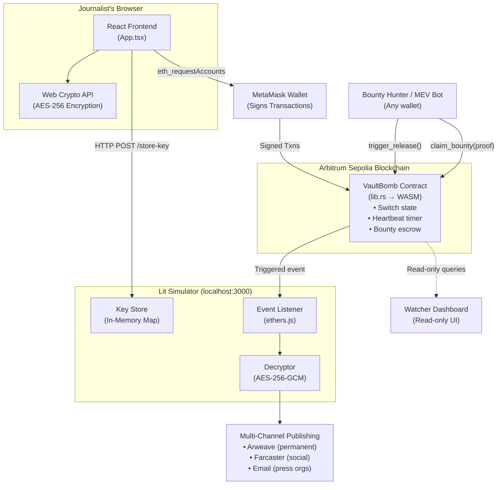

# 💣 Vault_bomb — PROJECT EXPLAINER

> **Audience:** You know programming but are new to blockchain / Web3.
> Every Web3-specific term is explained in context the first time it appears and collected in the Glossary at the end.

---

## 1. PROJECT OVERVIEW

### What does Vault_bomb do, in plain English?

Imagine an investigative journalist has gathered explosive evidence of corruption. They are worried that someone powerful might detain, disappear, or kill them to suppress the information. They need a **dead-man's switch**: a system that automatically publishes the evidence if the journalist goes silent.

Vault_bomb is that system. It works like this:

1. The journalist encrypts their secret evidence and locks it away.
2. They periodically send a **"heartbeat"** signal (a blockchain transaction) that says *"I am still alive and safe."*
3. If the heartbeat stops arriving for a pre-set period, *anyone in the world* can trigger the system, which automatically **decrypts and publishes** the evidence to multiple permanent, uncensorable channels.
4. The person who triggered the release earns a monetary **bounty** (paid in cryptocurrency) as an incentive.

### Why does this need a blockchain?

A traditional server-based dead-man's switch has a fatal flaw: someone can coerce, hack, subpoena, or bribe the server operator into deleting the evidence or disabling the timer. With blockchain-based smart contracts, the logic is **immutable** — once deployed, nobody (not even the developer) can stop, pause, or modify it. The code runs exactly as written, enforced by thousands of independent computers on the network.

### Tech stack

| Layer | Technology | Purpose |
|---|---|---|
| Smart contract | **Rust** compiled to WASM via **Arbitrum Stylus SDK** | The immutable heartbeat/trigger state machine on the blockchain |
| Blockchain network | **Arbitrum Sepolia** (Ethereum Layer-2 testnet) | Where the contract lives and transactions are processed |
| Key custody (simulated) | **Node.js / Express** simulating **Lit Protocol** | Holds the decryption key; only releases it when the contract state says `TRIGGERED` |
| Permanent storage (simulated) | **Arweave** (referenced conceptually) | Stores the encrypted evidence permanently |
| Frontend | **React 19 + TypeScript + Vite** | User interface for journalists and public watchers |
| Wallet interaction | **ethers.js v6** + **MetaMask** | How the browser talks to the blockchain |

---

## 2. FOLDER & FILE STRUCTURE

```
Vault_bomb/
├── .git/                                # Git version control metadata
├── .gitignore                           # Tells Git which files to ignore (node_modules, .env, build artifacts)
│
├── README.md                            # Project overview, architecture diagram, and demo instructions
├── architecture.md                      # Standalone architecture reference with data-flow descriptions
├── deadmans_switch_build_todo.md        # Phased roadmap: from MVP to production hardening
├── deadmans_switch_architecture.png     # Visual component diagram (the image shown in architecture.md)
│
├── contracts/                           # The Arbitrum Stylus smart contract (Rust)
│   ├── Cargo.toml                       # Rust package manifest — declares dependencies (stylus-sdk, alloy)
│   ├── deploy.sh                        # Shell script to deploy the contract to Arbitrum Sepolia
│   └── src/
│       └── lib.rs                       # THE smart contract — all on-chain logic lives here
│
├── frontend/                            # The React web application
│   ├── index.html                       # HTML entry point — Vite injects the React app into <div id="root">
│   ├── package.json                     # Node.js manifest — lists React, ethers.js, Vite dependencies
│   ├── package-lock.json                # Exact pinned dependency versions (auto-generated)
│   ├── tsconfig.json                    # TypeScript compiler options for application code
│   ├── tsconfig.node.json               # TypeScript compiler options for Vite's own config file
│   ├── vite.config.ts                   # Vite bundler configuration (just enables the React plugin)
│   └── src/
│       ├── main.tsx                     # React entry point — renders <App /> into the DOM
│       ├── App.tsx                      # THE frontend — journalist setup UI + public watcher dashboard
│       ├── index.css                    # Global styles — dark theme, glassmorphism cards, animations
│       └── vite-env.d.ts               # TypeScript type declarations for Vite's special imports
│
└── lit-simulator/                       # Mock Lit Protocol server (Node.js)
    ├── index.js                         # Express server that stores keys, listens for blockchain events, decrypts
    ├── package.json                     # Node.js manifest — lists Express, ethers.js, cors, dotenv
    └── package-lock.json                # Exact pinned dependency versions (auto-generated)
```

---

## 3. ARCHITECTURE

### 3.1 High-level component diagram



**Three independent systems cooperate:**

1. **The Smart Contract** (on-chain, immutable) — the source of truth for whether the heartbeat has expired.
2. **The Lit Simulator** (off-chain, would be decentralized in production) — custodian of the secret decryption key.
3. **The Frontend** (in the user's browser) — user interface that orchestrates setup and monitoring.

### 3.2 Full lifecycle walkthrough: "Arming the switch"

Here is what happens when a journalist clicks **"Encrypt & Arm Switch"**, step by step:

```
Step 1: LOCAL ENCRYPTION (browser, no network)
├── Browser Web Crypto API generates a random 256-bit AES key
├── Evidence text is encrypted with AES-256-GCM → produces ciphertext
├── SHA-256 hash of the original evidence is computed (for integrity verification later)
│
Step 2: KEY CUSTODY (browser → Lit Simulator HTTP)
├── Frontend sends HTTP POST to http://localhost:3000/store-key
│   Body: { journalistAddress, aesKey, evidenceHash, ciphertext }
├── Lit Simulator stores this in an in-memory Map
├── Returns { success: true, litSignature: "0xdeadbeef..." }
│
Step 3: ON-CHAIN REGISTRATION (browser → MetaMask → Arbitrum)
├── Frontend calls ethers.js to build a transaction invoking register_switch()
│   Parameters: heartbeat window, Arweave TX ID, evidence hash, duress wallet
│   Value: bounty amount in ETH (sent with the transaction as msg.value)
├── MetaMask pops up asking the journalist to review and sign the transaction
├── Signed transaction is broadcast to the Arbitrum Sepolia RPC endpoint
├── Arbitrum validators execute the contract's register_switch() function
│   ├── Stores all switch parameters in the switches mapping
│   ├── Sets last_heartbeat_block = current block number
│   ├── Deposits the ETH bounty inside the contract
│   └── Emits SwitchRegistered event
├── Frontend waits for tx.wait() — confirmation that the block is mined
└── UI updates status from "Unregistered" to "Armed"
```

### 3.3 Lifecycle walkthrough: "Trigger & Release"

```
Step 1: HEARTBEAT EXPIRES (no action from journalist)
├── Current block number exceeds last_heartbeat + window + grace_period
│
Step 2: TRIGGER (any wallet, typically an MEV bot)
├── Bot calls trigger_release(journalistAddress) on the contract
├── Contract verifies the time condition is met
├── Sets is_triggered = true, records triggerer's address
├── Emits Triggered(journalist, triggerer, arweaveTxId) event
│
Step 3: DECRYPTION (Lit Simulator reacts to the event)
├── ethers.js event listener catches the Triggered event
├── Looks up the journalist's AES key from the in-memory Map
├── Decrypts the ciphertext using AES-256-GCM
├── Verifies SHA-256(plaintext) matches the stored evidence hash
│
Step 4: MULTI-CHANNEL PUBLISHING (from inside Lit Action)
├── Writes plaintext to local file (simulates Arweave upload)
├── Logs simulated Farcaster post
├── Logs simulated email dispatch
├── Generates a publication proof hash
│
Step 5: BOUNTY CLAIM (bot collects reward)
├── Bot calls claim_bounty(journalist, litProof) on the contract
├── Contract verifies caller is the recorded triggerer
├── Emits BountyClaimed event (ETH transfer not yet implemented)
```

### 3.4 How components talk to each other

**Frontend ↔ Blockchain (via ethers.js):**

> **Web3 Concept: ethers.js** — A JavaScript library that translates human-readable function calls (like `contract.heartbeat()`) into raw blockchain transactions. It handles encoding function names and parameters into the binary format the blockchain understands (see **ABI** below).

> **Web3 Concept: ABI (Application Binary Interface)** — A JSON specification that describes a smart contract's functions, their parameters, and return types. Think of it as an API schema for a smart contract. The frontend needs the ABI to know how to encode a `register_switch(50, "arweave_tx_123", ...)` call into the raw bytes that the contract expects.

> **Web3 Concept: Provider vs Signer** — A *Provider* is a read-only connection to the blockchain (can read data, listen for events). A *Signer* is a Provider with a private key attached (can also send transactions that modify state). `BrowserProvider` wraps MetaMask; `JsonRpcProvider` connects directly to an RPC node without a wallet.

**Frontend → Lit Simulator (via HTTP):**
Standard REST API call. The frontend POSTs the AES key and ciphertext to `localhost:3000/store-key`.

**Lit Simulator ← Blockchain (via ethers.js event listener):**
The simulator creates an `ethers.Contract` instance connected to the deployed contract address and calls `contract.on("Triggered", callback)`. This subscribes to the `Triggered` event. When the contract emits that event, the callback fires and the simulator begins decryption.

> **Web3 Concept: Events / Logs** — Smart contracts can "emit" events, which are cheap data entries stored in the blockchain's transaction receipt logs. Off-chain code subscribes to these events to react when something happens on-chain. Events are NOT stored in contract state — they are write-only, append-only logs that are cheap to produce but can only be read by external observers.

---

## 4. SMART CONTRACT DEEP DIVE

**File:** [lib.rs](file:///home/harshsys_hypr/Vault_bomb/contracts/src/lib.rs)

### 4.1 Crate-level configuration (lines 1–8)

```rust
#![cfg_attr(not(any(test, feature = "export-abi")), no_main)]
extern crate alloc;
```

`no_main` tells the Rust compiler this is not a regular executable — it's a WASM module that will be loaded by the blockchain virtual machine. The `alloc` crate provides heap allocation (needed for `Vec`, `String`) without a standard library.

> **Web3 Concept: WASM (WebAssembly)** — A portable binary instruction format. Arbitrum Stylus allows smart contracts written in Rust to compile to WASM instead of the traditional EVM bytecode. WASM execution is significantly faster and cheaper in terms of gas costs.

### 4.2 Event declarations (lines 10–15)

```rust
sol! {
    event Triggered(address indexed journalist, address indexed triggerer, string arweaveTxId);
    event SwitchRegistered(address indexed journalist, uint256 heartbeatWindowBlocks, uint256 bountyAmount);
    event HeartbeatReceived(address indexed journalist, uint256 blockNumber);
    event BountyClaimed(address indexed journalist, address indexed triggerer, uint256 amount);
}
```

The `sol!` macro lets you write Solidity-style event declarations inside Rust. These events are emitted during transactions and stored in blockchain logs.

> **Web3 Concept: `indexed` keyword** — When an event parameter is `indexed`, it is stored in a special searchable data structure (a "topic") in the log entry. This allows off-chain code to efficiently filter events — for example, "show me all `Triggered` events where `journalist` is address `0xABC...`". Non-indexed parameters are stored in the data portion of the log and cannot be filtered on directly.

### 4.3 Storage layout (lines 17–43)

**`VaultBomb` (the main contract struct):**

| Field | Type | Purpose |
|---|---|---|
| `switches` | `mapping(address => Switch)` | Maps each journalist's wallet address to their Switch configuration |
| `registered_journalists` | `address[]` | Dynamic array of all journalist addresses (enables iteration for `check_upkeep`) |
| `lit_action_pubkey` | `address` | Placeholder for Lit Protocol's threshold public key (for proof verification — currently unused) |

**`Switch` struct (per-journalist state):**

| Field | Type | Purpose |
|---|---|---|
| `is_active` | bool | Whether this journalist has registered a switch |
| `is_triggered` | bool | Whether the dead-man's switch has fired |
| `bounty_claimed` | bool | Whether the bounty has been paid out |
| `registered_wallet` | address | The journalist's primary wallet — authorized to send heartbeats |
| `duress_wallet` | address | A special wallet: if a heartbeat comes from this address, it triggers an IMMEDIATE release (the journalist is being coerced) |
| `backup_wallet` | address | A secondary wallet authorized to send heartbeats (e.g., a trusted colleague) |
| `triggerer_wallet` | address | Who called `trigger_release()` — they get the bounty |
| `heartbeat_window_blocks` | uint256 | How many blocks can pass without a heartbeat before the switch is eligible to trigger |
| `grace_period_blocks` | uint256 | Extra buffer after the window, giving the journalist a last chance |
| `last_heartbeat_block` | uint256 | The block number of the most recent heartbeat |
| `last_nonce` | uint256 | Replay protection counter — each heartbeat must use a higher nonce |
| `bounty_amount` | uint256 | How much ETH the journalist deposited as a reward for triggering |
| `arweave_tx_id` | string | Reference to the encrypted evidence on Arweave |
| `evidence_hash` | bytes32 | SHA-256 hash of the plaintext, used to verify integrity after decryption |

> **Web3 Concept: Contract Storage** — Every smart contract has its own persistent key-value store on the blockchain. Variables declared in the storage struct are written to the blockchain when modified — this costs gas (transaction fees). Reading storage is free for external queries but costs gas when done inside a state-changing function.

> **Web3 Concept: `mapping`** — A hash-table-like data structure. `mapping(address => Switch)` maps each journalist's wallet address to their `Switch` struct. Unlike a regular hash map, you cannot iterate over all keys — you can only look up a known key. That is why a separate `registered_journalists` array is needed for the Watcher Dashboard.

> **Web3 Concept: `address`** — A 20-byte identifier (40 hex characters, prefixed with `0x`) representing an account on Ethereum. Can be a person's wallet or another smart contract.

> **Web3 Concept: `uint256`** — An unsigned 256-bit integer. This is the default integer type on Ethereum. It can represent numbers up to ~1.15 × 10⁷⁷. Used for block numbers, token amounts, and general arithmetic.

> **Web3 Concept: `bytes32`** — A fixed-size 32-byte value. Commonly used for hashes (SHA-256 produces 32 bytes).

### 4.4 Function-by-function walkthrough

---

#### `register_switch()` — Lines 48–90

```rust
#[payable]
pub fn register_switch(&mut self, heartbeat_window_blocks: U256, ...) -> Result<(), Vec<u8>>
```

> **Web3 Concept: `#[payable]`** — This attribute allows the function to receive ETH along with the transaction. Without it, any transaction that sends ETH to this function would be automatically rejected. The amount sent is accessible via `msg::value()`.

> **Web3 Concept: `msg::sender()` and `msg::value()`** — Every transaction on Ethereum carries metadata. `msg::sender()` is the wallet address that initiated the transaction. `msg::value()` is the amount of ETH (in wei, the smallest unit: 1 ETH = 10¹⁸ wei) attached to the transaction.

**What it does:**
1. Reads the caller's address (`msg::sender()`) and the ETH they sent (`msg::value()`).
2. Checks the journalist hasn't already registered (prevents double-registration).
3. Initializes all `Switch` fields — sets `last_heartbeat_block` to the current block number (the timer starts now).
4. Pushes the journalist's address into `registered_journalists` (so the Watcher can iterate over all switches).
5. Emits `SwitchRegistered` event.

**Design note:** The ETH bounty is deposited simply by sending it with the transaction — the contract holds it in its own balance. There is no separate "deposit" function.

---

#### `heartbeat()` — Lines 92–136

```rust
pub fn heartbeat(&mut self, journalist: Address, nonce: U256) -> Result<(), Vec<u8>>
```

**What it does:**
1. Verifies the switch is active and not already triggered.
2. Checks the nonce is strictly greater than `last_nonce` (replay protection — prevents someone from re-broadcasting a captured heartbeat transaction).

> **Web3 Concept: Nonce (Application-Level)** — Not to be confused with the transaction nonce (which Ethereum itself manages). This is an application-level counter that prevents replay attacks. Without it, an attacker could observe a heartbeat transaction on the public blockchain mempool and re-submit the exact same data later, resetting the timer fraudulently. The strictly-increasing requirement means each heartbeat must be genuinely new.

3. **Duress path:** If the caller is the `duress_wallet`, the switch is immediately triggered (emits `Triggered` event) and returns. The idea: if the journalist is being coerced, signing with their duress key releases the evidence immediately instead of stalling.
4. **Normal path:** Verifies caller is either the registered wallet or the backup wallet. If authorized, resets `last_heartbeat_block` to the current block number and emits `HeartbeatReceived`.

> **Web3 Concept: Block Number** — Every blockchain is a chain of blocks. Each block has a sequential number. On Arbitrum, a new block is produced roughly every 250 milliseconds. Smart contracts can read `block::number()` to know "what time it is" on the blockchain. Using block numbers instead of wall-clock timestamps is more reliable, because timestamps can be slightly manipulated by validators.

---

#### `trigger_release()` — Lines 140–171

```rust
pub fn trigger_release(&mut self, journalist: Address) -> Result<(), Vec<u8>>
```

**This is the heart of the dead-man's switch.** It is **completely permissionless** — there is no access control check on who can call it. The only gate is the time condition:

```rust
if current_block > last_heartbeat + window + grace {
    sw.is_triggered.set(true);
    ...
}
```

**What it does:**
1. Checks the switch is active and not already triggered.
2. Reads current block number, compares it against `last_heartbeat_block + heartbeat_window_blocks + grace_period_blocks`.
3. If the deadline has passed: flips state to `TRIGGERED`, records `msg::sender()` as the triggerer (they will claim the bounty), and emits `Triggered` event.
4. If the deadline has NOT passed: reverts with "Window not expired."

> **Web3 Concept: Permissionless** — Any wallet address on the network can call this function. This is deliberate: the system relies on economic incentives (the bounty) rather than trusted operators. Even if every "official" automation service is shut down, a random person or bot can still trigger the release.

> **Web3 Concept: Revert** — When a smart contract returns an error (in Rust, returns `Err(...)`), the entire transaction is "reverted" — all state changes are undone, and the caller only pays for the gas consumed up to the failure point.

---

#### `claim_bounty()` — Lines 175–214

```rust
pub fn claim_bounty(&mut self, journalist: Address, lit_proof: Bytes) -> Result<(), Vec<u8>>
```

**What it does:**
1. Checks the switch was triggered and the bounty hasn't been claimed yet.
2. Verifies caller is the `triggerer_wallet` (the address that called `trigger_release()`).
3. Checks that `lit_proof` is non-empty (in a production version, this would cryptographically verify the proof was signed by Lit Protocol's threshold key).
4. Marks bounty as claimed and emits `BountyClaimed`.

**Important caveat:** The actual ETH transfer is **not implemented** — only the event is logged. The comment in the code explains that Stylus raw ETH transfers are verbose, and this is simplified for the hackathon demo.

---

#### `check_upkeep()` / `perform_upkeep()` — Lines 217–262

These two functions implement the **Chainlink Automation** interface.

> **Web3 Concept: Chainlink Automation (formerly Keepers)** — A decentralized network of bots that periodically call `checkUpkeep()` on your contract. If it returns `true`, they automatically call `performUpkeep()`. This is how you automate on-chain actions without running your own server.

- **`check_upkeep()`** — Iterates through all registered journalists. If any switch has an expired window, returns `(true, encodedJournalistAddress)`.
- **`perform_upkeep()`** — Decodes the journalist address from the data and calls `trigger_release()`.

---

#### View functions — Lines 266–289

```rust
pub fn get_registered_journalists_count(&self) -> ...
pub fn get_registered_journalist(&self, index: U256) -> ...
pub fn get_switch_info(&self, journalist: Address) -> ...
```

> **Web3 Concept: View Functions** — Functions marked with `&self` (no `&mut self`) do not modify state. They are "free" to call — no gas cost, no transaction needed. The frontend can query them at any time to read the current state of the contract. This is how the Watcher Dashboard gets its data.

---

### 4.5 Access control summary

| Function | Who can call it |
|---|---|
| `register_switch()` | Any address (but only once per address) |
| `heartbeat()` | `registered_wallet`, `backup_wallet`, or `duress_wallet` only |
| `trigger_release()` | **Anyone** (permissionless — gated only by time) |
| `claim_bounty()` | Only the address stored as `triggerer_wallet` |
| `check_upkeep()` | Anyone (read-only) |
| `perform_upkeep()` | Anyone (delegates to `trigger_release()`) |
| View functions | Anyone (read-only, free) |

### 4.6 Dependencies (Cargo.toml)

| Crate | Version | Purpose |
|---|---|---|
| `alloy-primitives` | 0.7.6 | Provides `Address`, `U256`, `B256`, `Bytes` types |
| `alloy-sol-types` | 0.7.6 | Provides the `sol!` macro for declaring Solidity-compatible events and types |
| `stylus-sdk` | 0.6.0 | The Arbitrum Stylus framework — provides `#[entrypoint]`, `sol_storage!`, `evm::log`, `msg::sender()`, etc. |

**Build profile (`[profile.release]`):**
- `codegen-units = 1` — Compile as a single unit for maximum optimization.
- `panic = "abort"` — No unwinding on panic (WASM contracts can't unwind).
- `opt-level = "z"` — Optimize for minimum binary size (critical for on-chain deployment, since larger contracts cost more gas to deploy).
- `lto = true` — Link-Time Optimization enabled.

---

## 5. FRONTEND / SCRIPTS DEEP DIVE

### 5.1 Entry point chain

**[index.html](file:///home/harshsys_hypr/Vault_bomb/frontend/index.html)** → Vite injects the bundled JS into `<div id="root">`.

**[main.tsx](file:///home/harshsys_hypr/Vault_bomb/frontend/src/main.tsx)** → Standard React 19 setup: renders `<App />` inside `React.StrictMode` into the root element.

**[vite.config.ts](file:///home/harshsys_hypr/Vault_bomb/frontend/vite.config.ts)** → Minimal Vite configuration that just enables the React plugin (JSX transform).

**[tsconfig.json](file:///home/harshsys_hypr/Vault_bomb/frontend/tsconfig.json)** → TypeScript strict mode enabled, targeting ES2020, using bundler module resolution (for Vite), JSX set to `react-jsx`.

**[tsconfig.node.json](file:///home/harshsys_hypr/Vault_bomb/frontend/tsconfig.node.json)** → Separate TypeScript config just for `vite.config.ts` itself (Vite's build tool runs in Node.js, not in the browser, so it needs different settings).

**[vite-env.d.ts](file:///home/harshsys_hypr/Vault_bomb/frontend/src/vite-env.d.ts)** → A TypeScript declaration file that tells the compiler about Vite-specific types (like `import.meta.env`).

### 5.2 Wallet connection

In [App.tsx](file:///home/harshsys_hypr/Vault_bomb/frontend/src/App.tsx#L30-L42), the `connectWallet()` function:

```typescript
const provider = new ethers.BrowserProvider((window as any).ethereum);
const accounts = await provider.send("eth_requestAccounts", []);
```

> **Web3 Concept: `window.ethereum`** — When MetaMask (or any browser wallet) is installed, it injects a global object called `window.ethereum` into every webpage. This object is the bridge between the webpage and the wallet. The webpage can request accounts, ask the user to sign transactions, and read blockchain data through it.

> **Web3 Concept: `eth_requestAccounts`** — A JSON-RPC method that tells MetaMask to pop up its UI and ask the user "Do you want to connect this website to your wallet?" If the user approves, it returns their wallet address(es). This is the standard "Connect Wallet" flow.

### 5.3 The two tabs

**Tab 1: Journalist Setup** — Used by the journalist to:

1. **Encrypt evidence** (lines 53–123): Uses the browser's native `window.crypto.subtle` API to:
   - Generate a random AES-256-GCM key
   - Encrypt the evidence text
   - Compute a SHA-256 hash of the plaintext
   - Encode everything as Base64 for transmission

2. **Send key to Lit** (lines 81–93): Sends a `fetch()` POST request to `http://localhost:3000/store-key` with the AES key, ciphertext, and evidence hash.

3. **Register on-chain** (lines 97–113): Creates an `ethers.Contract` instance with the contract ABI and calls `register_switch()` via MetaMask. The `{ value }` option attaches ETH to the transaction as the bounty deposit.

4. **Send heartbeat** (lines 125–141): Calls `contract.heartbeat()` to reset the timer.

**Tab 2: Public Watcher Dashboard** — Used by anyone to:

1. **View all switches** (lines 144–174): Queries `get_registered_journalists_count()` and `get_switch_info()` on the contract. Falls back to mock data when no contract is deployed.

2. **Act as a bot** (lines 182–220): Allows connected users to call `trigger_release()` and `claim_bounty()` directly from the UI, simulating what an MEV bot would do automatically.

### 5.4 ABI in the frontend

```typescript
const ABI = [
  "function register_switch(uint256, string, bytes32, address) external payable",
  "function heartbeat() external",
  // ...
];
```

> **Web3 Concept: Human-Readable ABI** — ethers.js supports a shorthand format where you write ABI entries as human-readable strings instead of verbose JSON objects. This is syntactic sugar — under the hood, ethers.js parses these strings into the full ABI specification.

### 5.5 Deployment script

**[deploy.sh](file:///home/harshsys_hypr/Vault_bomb/contracts/deploy.sh):**

```bash
cargo stylus check       # Validates the WASM bytecode against Stylus constraints
cargo stylus deploy --private-key $PRIVATE_KEY   # Deploys to Arbitrum Sepolia
```

> **Web3 Concept: Private Key** — A 256-bit secret number that gives full control over a blockchain account. Anyone who knows your private key can spend all your funds and act as you. The deployment script needs it to sign the deployment transaction. **Never commit a private key to Git** — this is why `.env` is in `.gitignore`.

The script:
1. Loads environment variables from `.env` (if it exists).
2. Validates that `PRIVATE_KEY` is set.
3. Runs `cargo stylus check` to validate the WASM bytecode meets Arbitrum Stylus's on-chain verification constraints.
4. Deploys the contract using `cargo stylus deploy`.

### 5.6 Styles

**[index.css](file:///home/harshsys_hypr/Vault_bomb/frontend/src/index.css):** A polished dark theme with:
- **Glassmorphism cards** — semi-transparent backgrounds with `backdrop-filter: blur(10px)`.
- **Gradient buttons** — `linear-gradient(135deg, #ff3366 0%, #d41442 100%)` for the primary action.
- **Pulse animation** — the `.status.active` badge pulses with a green glow to indicate the switch is armed and alive.
- **Spinner loader** — CSS-only spinning circle for processing states.
- **Inter font** — imported from Google Fonts for clean typography.
- **Radial gradient background** — subtle depth effect on the page background.

### 5.7 Package dependencies

**Frontend ([package.json](file:///home/harshsys_hypr/Vault_bomb/frontend/package.json)):**
- `ethers ^6.17.0` — Blockchain interaction library
- `react ^19.2.7` / `react-dom ^19.2.7` — UI framework
- `vite ^8.1.5` — Build tool and dev server
- `typescript ^7.0.2` — Type checking
- `@vitejs/plugin-react ^6.0.3` — Vite's React JSX transform

**Lit Simulator ([package.json](file:///home/harshsys_hypr/Vault_bomb/lit-simulator/package.json)):**
- `express ^5.2.1` — HTTP server framework
- `ethers ^6.17.0` — Blockchain event listener
- `cors ^2.8.6` — Cross-Origin Resource Sharing middleware (allows the frontend on a different port to call the API)
- `dotenv ^17.4.2` — Loads `.env` files into `process.env`

---

## 6. LIT SIMULATOR DEEP DIVE

**File:** [index.js](file:///home/harshsys_hypr/Vault_bomb/lit-simulator/index.js)

This is a **mock server** that simulates what the real Lit Protocol network would do. In production, this entire server would be replaced by a decentralized Lit Action running across Lit Protocol's MPC node network.

### What it does:

**`POST /store-key` endpoint (lines 16–35):**
Receives the AES key, ciphertext, and evidence hash from the frontend. Stores them in an in-memory JavaScript `Map`, keyed by the journalist's lowercased wallet address. Returns a mock "Lit signature" acknowledging key receipt.

In the real Lit Protocol, this key would be threshold-encrypted and distributed across dozens of independent nodes — no single node would hold the complete key.

**Event listener (lines 49–118):**
Creates an ethers.js `JsonRpcProvider` connected to Arbitrum Sepolia's public RPC and listens for `Triggered` events on the deployed contract:

```javascript
contract.on("Triggered", async (journalist, triggerer, arweaveTxId) => { ... });
```

When the event fires:
1. Looks up the journalist's stored key data from the in-memory `Map`.
2. Extracts the IV (first 12 bytes), auth tag (last 16 bytes), and actual ciphertext from the combined buffer.
3. Decrypts using Node.js `crypto.createDecipheriv('aes-256-gcm', ...)`.
4. Verifies the SHA-256 hash of the decrypted plaintext matches the stored hash (integrity check).
5. Writes the plaintext to a local file: `released_evidence_<timestamp>.txt`.
6. Logs simulated multi-channel publishing (Arweave, Farcaster, Email).
7. Generates a mock "publication proof" (SHA-256 of `"PUBLISHED" + journalistAddress`).

> **Web3 Concept: Access Control Condition (ACC)** — In Lit Protocol, an ACC is a rule like: "Only execute this code if [some on-chain condition] is true." In Vault_bomb, the ACC is: `VaultBomb.switches[journalist].is_triggered == true`. Every Lit node independently verifies this condition by querying the blockchain before participating in threshold decryption. The simulator mocks this by simply listening for the `Triggered` event.

---

## 7. WHAT IS IMPLEMENTED CORRECTLY

### Smart Contract

- **✅ No admin functions, no pause, no proxy.** The contract has zero functions that could allow anyone to stop, modify, or redirect a registered switch after deployment. This is the core "unstoppable" guarantee and is correctly enforced by the deliberate absence of such code.

- **✅ Permissionless `trigger_release()` with bounty incentive.** The function has no `msg::sender` check — only a time check. This means the system degrades gracefully: even if Chainlink and Gelato both go offline, any random wallet can trigger the release. The bounty creates an economic incentive (particularly for MEV bots) to do so.

- **✅ Replay-protected heartbeat with nonces.** The `nonce <= last_nonce` check prevents an adversary from re-broadcasting a previously observed heartbeat transaction to keep resetting the timer.

- **✅ Duress wallet mechanism.** A heartbeat from the duress address immediately triggers the release instead of resetting the timer. This handles the "forced to sign at gunpoint" scenario — an elegant safety feature.

- **✅ Idempotent trigger.** Once `is_triggered == true`, subsequent calls revert with "Already triggered." This prevents double-triggering and double-bounty-claiming.

- **✅ Chainlink-compatible interface.** `check_upkeep()` / `perform_upkeep()` follow the standard Chainlink Automation interface, meaning the contract is ready for Chainlink Automation with no changes.

- **✅ Aggressive WASM optimization.** The `[profile.release]` settings in Cargo.toml (`opt-level = "z"`, `lto = true`, `codegen-units = 1`, `panic = "abort"`) minimize the compiled binary size, which directly reduces deployment gas costs.

### Frontend

- **✅ Client-side encryption.** Evidence is encrypted in the browser before being sent anywhere. The plaintext never leaves the journalist's machine. The Web Crypto API provides strong, browser-native AES-256-GCM.

- **✅ Correct AES-GCM packaging.** The IV is correctly prepended to the ciphertext, and later the Lit Simulator correctly extracts the IV (first 12 bytes) and auth tag (last 16 bytes) for decryption. This is the standard packaging approach.

- **✅ Clean separation of concerns.** The "Journalist Setup" and "Watcher Dashboard" tabs clearly separate the two user personas (journalist vs. public observer / bot operator).

- **✅ Polished UI.** The glassmorphism dark theme is professional and appropriately serious for the use case. The pulse animation on the "Armed" status is a nice UX touch.

### Lit Simulator

- **✅ Hash verification after decryption.** The simulator verifies `SHA-256(decrypted) == stored hash` before publishing, catching any data corruption or key mismatch.

- **✅ Event-driven architecture.** The simulator listens for on-chain events rather than polling, which is more responsive, and does not cost gas.

---

## 8. WHAT IS IMPLEMENTED INCORRECTLY OR RISKY

### Smart Contract Issues

#### 8.1 🔴 `claim_bounty()` does not actually transfer ETH

**Where:** [lib.rs](file:///home/harshsys_hypr/Vault_bomb/contracts/src/lib.rs#L196-L211)

**The problem:** The function emits a `BountyClaimed` event but never actually sends the ETH to the triggerer. The ETH deposited during `register_switch()` is permanently locked in the contract with no way to retrieve it.

**Why it matters:** The bounty is the backup trigger mechanism. Without it, the entire economic incentive model is broken — bots have no financial reason to trigger the release because they will never receive the payment. This severely weakens the "unstoppable" guarantee.

**What the fix looks like:** Use the Stylus SDK's raw call mechanism or a dedicated transfer helper to send `amount` wei to `caller`. You will also need to handle the case where the transfer fails (e.g., the receiving address is a contract that rejects ETH).

---

#### 8.2 🔴 `heartbeat()` signature does not match the frontend ABI

**Where:** Contract: `fn heartbeat(&mut self, journalist: Address, nonce: U256)` vs Frontend ABI: `"function heartbeat() external"`

**The problem:** The smart contract expects two parameters (`journalist` and `nonce`), but the frontend ABI declares `heartbeat()` with zero parameters. When the frontend calls `contract.heartbeat()`, the transaction will either fail with a decoding error or call the wrong function selector.

> **Web3 Concept: Function Selector** — The first 4 bytes of the `keccak256` hash of a function's signature (name + parameter types). For example, `heartbeat()` and `heartbeat(address,uint256)` produce completely different 4-byte selectors. If the ABI specifies the wrong signature, ethers.js will compute the wrong selector, and the contract will not recognize the call.

**Why it matters:** The heartbeat is the journalist's lifeline. If they cannot send heartbeats due to a mismatched ABI, the switch will fire prematurely and release their evidence when they did not want it released.

**What the fix looks like:** Update the frontend ABI string to match the contract signature: `"function heartbeat(address journalist, uint256 nonce) external"`. Then update `handleHeartbeat()` to pass the journalist's address and an incrementing nonce.

---

#### 8.3 🔴 `register_switch()` signature mismatch with frontend ABI

**Where:** Contract expects 6 params: `(uint256, uint256, string, bytes32, address, address)` — including `grace_period_blocks` and `backup_wallet`. Frontend ABI has only 4 params: `(uint256, string, bytes32, address)`.

**The problem:** Same class of bug as §8.2. The function selector will differ, so the contract will not recognize the function call at all. Registration will silently fail or revert.

**Why it matters:** The journalist thinks they've armed their switch, but nothing happened on-chain. Their evidence has no dead-man's switch protection.

---

#### 8.4 🟡 `lit_proof` validation is a stub

**Where:** [lib.rs](file:///home/harshsys_hypr/Vault_bomb/contracts/src/lib.rs#L192-L194)

```rust
if lit_proof.len() == 0 {
    return Err("Invalid Lit Action proof".as_bytes().to_vec());
}
```

**The problem:** Any non-empty byte string passes validation. A malicious triggerer can submit `0x01` and claim the bounty without the evidence ever being published.

**Why it matters:** Without proper proof verification, the bounty mechanism is exploitable. A bot could call `trigger_release()` and then immediately `claim_bounty(journalist, 0x01)` to steal the bounty without running the Lit Action or publishing anything. The journalist's bounty would be drained, but their evidence would remain encrypted and unreleased.

**What the fix looks like:** Use `ecrecover` (ECDSA signature recovery) to verify that `lit_proof` was signed by the Lit Protocol network's known threshold public key. The contract already has a `lit_action_pubkey` storage variable for this purpose — it just isn't used.

---

#### 8.5 🟡 No way to cancel or update a switch

**Where:** The entire contract — there is no `cancel_switch()`, `update_window()`, or `withdraw_bounty()` function.

**The problem:** If a journalist registers a switch by mistake, sets the wrong heartbeat window, or simply wants to retire their switch, their ETH bounty is permanently locked and the switch will eventually fire.

**Why it matters:** Real users make mistakes. A journalist who accidentally registers with a 5-block window instead of 50,000 blocks will have their evidence released within seconds, with no recourse. This is a deliberate design choice (immutability as a feature), but it lacks even a minimal "cooling-off period" cancel mechanism.

---

#### 8.6 🟡 Unbounded loop in `check_upkeep()`

**Where:** [lib.rs](file:///home/harshsys_hypr/Vault_bomb/contracts/src/lib.rs#L223-L237)

```rust
let count = self.registered_journalists.len();
for i in 0..count { ... }
```

**The problem:** If thousands of journalists register, this loop will consume more gas than a single block allows, making `check_upkeep()` permanently revert. Chainlink Automation would be unable to find expired switches.

> **Web3 Concept: Block Gas Limit** — Each block on Ethereum/Arbitrum has a maximum total gas it can contain. If a single function call requires more gas than this limit, it can never be executed. This is why unbounded loops in smart contracts are dangerous.

**Why it matters:** At scale, the entire Chainlink-based automated trigger mechanism breaks. Only manual `trigger_release()` calls for specific journalist addresses would work.

**What the fix looks like:** Use pagination (pass a start index and batch size), or maintain a separate "pending" list sorted by expiry time, or rely entirely on off-chain indexers to identify which journalist to trigger and pass them directly.

---

#### 8.7 🟡 One switch per address — no re-registration

**Where:** [lib.rs](file:///home/harshsys_hypr/Vault_bomb/contracts/src/lib.rs#L62-L64)

```rust
if sw.is_active.get() {
    return Err("Already registered".as_bytes().to_vec());
}
```

**The problem:** After a switch fires (or even if the journalist simply wants to set up a new switch with different evidence), they can never register again from the same wallet. `is_active` is set to `true` during registration and is never set back to `false` anywhere in the code.

**Why it matters:** Journalists would need to create a new wallet for every switch. Workable but inconvenient and not documented.

---

#### 8.8 🟡 Duress heartbeat does not update `last_nonce`

**Where:** [lib.rs](file:///home/harshsys_hypr/Vault_bomb/contracts/src/lib.rs#L108-L118)

**The problem:** The duress path skips the nonce check and never calls `sw.last_nonce.set(nonce)`. While functionally harmless (the switch is triggered and can never return to normal), it is inconsistent — an observer analyzing the contract state after a duress trigger would see the nonce unchanged, which might leak information about whether a trigger was duress-initiated vs. timeout-initiated.

---

### Frontend Issues

#### 8.9 🔴 Hardcoded zero address for the contract

**Where:** [App.tsx](file:///home/harshsys_hypr/Vault_bomb/frontend/src/App.tsx#L5)

```typescript
const CONTRACT_ADDRESS = "0x0000000000000000000000000000000000000000";
```

**The problem:** The zero address (`0x000...000`) is a "burn address" on Ethereum — sending transactions to it will waste gas and achieve nothing. The frontend cannot interact with a real deployed contract until someone manually updates this line.

**What the fix looks like:** Use Vite's environment variable system: `import.meta.env.VITE_CONTRACT_ADDRESS` with a `.env` file. This separates configuration from code.

---

#### 8.10 🟡 No chain ID / network validation

**Where:** [App.tsx](file:///home/harshsys_hypr/Vault_bomb/frontend/src/App.tsx) — `connectWallet()` and all transaction functions.

**The problem:** The frontend does not check which blockchain network MetaMask is connected to. If the user is on Ethereum mainnet instead of Arbitrum Sepolia, their transaction will either fail (if no contract exists at that address on that chain) or worse, interact with an unexpected contract.

> **Web3 Concept: Chain ID** — A unique numeric identifier for each blockchain network (e.g., Ethereum mainnet = 1, Arbitrum Sepolia = 421614). dApps should verify the chain ID to ensure the user is on the correct network.

**What the fix looks like:** After connecting, call `provider.getNetwork()` and verify `network.chainId === 421614n`. If wrong, prompt the user to switch networks using `wallet_switchEthereumChain`.

---

#### 8.11 🟡 Mock data in the Watcher gives a false sense of functionality

**Where:** [App.tsx](file:///home/harshsys_hypr/Vault_bomb/frontend/src/App.tsx#L148-L154)

**The problem:** The Watcher always shows fake data when no contract is deployed. A user or hackathon judge might believe these are real on-chain switches. There is no visual indicator that the data is mocked.

---

#### 8.12 🟡 `fetch()` to Lit Simulator has no error handling for network failure

**Where:** [App.tsx](file:///home/harshsys_hypr/Vault_bomb/frontend/src/App.tsx#L81-L93)

**The problem:** If the Lit Simulator is not running (or the network is down), `fetch()` will throw an exception. While the `catch` block exists, the error message (`e.message`) will be cryptic ("Failed to fetch") with no guidance to the user.

---

### Lit Simulator Issues

#### 8.13 🔴 Key stored in memory — not persisted

**Where:** [index.js](file:///home/harshsys_hypr/Vault_bomb/lit-simulator/index.js#L14)

```javascript
const litKeyStore = new Map();
```

**The problem:** If the Node.js process restarts (crash, redeployment, power outage), all stored keys are lost forever. The journalist's evidence becomes permanently unrecoverable — the encrypted ciphertext on Arweave can never be decrypted.

**Why it matters:** This is a single point of catastrophic, irrecoverable failure. In the real Lit Protocol, this is solved by threshold key distribution across independent nodes with on-disk persistence and redundancy.

---

#### 8.14 🟡 No authentication on `/store-key` endpoint

**Where:** [index.js](file:///home/harshsys_hypr/Vault_bomb/lit-simulator/index.js#L16-L35)

**The problem:** Anyone who can reach `localhost:3000` can overwrite a journalist's stored key by POSTing a new value for the same `journalistAddress`. An attacker could replace the real AES key with garbage, making the evidence permanently unrecoverable.

**Why it matters:** The entire security model depends on the integrity of the stored key. In production Lit Protocol, key storage is controlled by cryptographic access conditions, not open HTTP endpoints.

---

#### 8.15 🟡 No reconnection logic for the event listener

**Where:** [index.js](file:///home/harshsys_hypr/Vault_bomb/lit-simulator/index.js#L59)

**The problem:** If the RPC WebSocket connection drops (common with public endpoints), `contract.on("Triggered", ...)` silently stops receiving events. The simulator would miss a trigger event and the evidence would never be released.

**What the fix looks like:** Use a polling fallback with `provider.on("block", ...)` to periodically re-check the contract state, or implement WebSocket reconnection logic with exponential backoff.

---

## 9. WHAT IS MISSING / NOT IMPLEMENTED

### Testing

- **No smart contract tests.** A production Stylus contract would have unit tests using Rust's `#[test]` framework with the `stylus-sdk` test utilities, plus integration tests on a forked testnet.
- **No frontend tests.** No component tests (React Testing Library), no integration tests, no E2E tests (Cypress/Playwright).
- **No Lit Simulator tests.** No tests for the decryption path, hash verification, or event listening.

### Smart Contract Gaps

- **No NatSpec / doc comments.** Solidity/Stylus contracts should have `///` doc comments on every public function explaining parameters, return values, and failure conditions. These are displayed by block explorers to help users understand what they are signing.
- **No `PlaintextPublished` event.** The architecture docs mention this event, but it is not implemented in the contract. The Watcher Dashboard has no way to know when evidence has been published, only when the trigger fired.
- **No actual ETH transfer in `claim_bounty()`.** The bounty system is incomplete without this.
- **No spam prevention.** Anyone can register switches, potentially flooding the `registered_journalists` array and the Watcher dashboard with junk data. The build todo acknowledges this as Phase 3 future work.
- **No switch cancellation mechanism.** No way to defuse a switch or withdraw the bounty within a cooling-off period.
- **No real Arweave integration.** The TX ID is a hardcoded mock string (`"arweave_mock_tx_123"`).
- **No `ecrecover` for bounty proof verification.** The `lit_action_pubkey` storage variable exists but is never set or used.

### Frontend Gaps

- **No chain ID / network validation.** (Discussed in §8.10.)
- **No transaction status feedback.** The UI shows "Processing..." but provides no link to a block explorer (like Arbiscan) where the user can monitor their pending transaction.
- **No nonce management for heartbeat.** The contract requires a strictly-increasing nonce, but the frontend's `handleHeartbeat()` does not track or pass a nonce at all.
- **No environment variable for contract address.** Should use `import.meta.env.VITE_CONTRACT_ADDRESS`.
- **No error recovery UI.** If registration partially fails (e.g., Lit key storage succeeds but the contract transaction reverts), the user has no way to retry just the contract step. They are stuck.
- **No responsive design breakpoints.** The CSS uses `max-width: 700px` but has no mobile-specific media queries.

### DevOps & Infrastructure Gaps

- **No CI/CD pipeline.** No GitHub Actions, no automated testing on push.
- **No linting configuration.** No ESLint, no Prettier for the frontend. No `clippy` invocation for the Rust contract.
- **No `.env.example` file.** No documentation of what environment variables are needed (`PRIVATE_KEY`, `CONTRACT_ADDRESS`, `RPC_URL`, `PORT`).
- **No Docker / containerization** for the Lit Simulator.
- **No IPFS deployment** for the Watcher Dashboard (mentioned in the architecture docs as a requirement).

### Security Gaps

- **No formal security audit.** The build todo correctly plans for one in Phase 2.
- **No rate limiting** on the Lit Simulator's `/store-key` endpoint.
- **No HTTPS** on the Lit Simulator. Key material (the AES key) is transmitted in plaintext over HTTP. In production, this would be a critical vulnerability — anyone on the same network could intercept the key.

---

## 10. GLOSSARY

| Term | Definition |
|---|---|
| **ABI** | Application Binary Interface — a JSON schema describing a smart contract's functions, events, and types. Used by off-chain code (like ethers.js) to encode/decode function calls. |
| **ACC** | Access Control Condition — a rule in Lit Protocol that gates key decryption on an on-chain condition (e.g., "this boolean on this contract must be true"). |
| **Address** | A 20-byte (40 hex character, `0x`-prefixed) identifier for an account on Ethereum. Represents a wallet or a smart contract. |
| **AES-256-GCM** | A symmetric encryption algorithm. 256-bit key, Galois/Counter Mode provides both confidentiality and integrity (authenticated encryption). |
| **Arbitrum** | An Ethereum Layer-2 scaling solution. Transactions are processed off-chain and periodically posted to Ethereum mainnet for security. Much cheaper and faster than L1. |
| **Arweave** | A decentralized permanent storage network. Pay once, store data forever. |
| **Block** | A bundle of transactions validated and added to the blockchain together. Each block has a sequential number. |
| **Block Gas Limit** | The maximum total gas a single block can contain. Functions requiring more gas than this limit can never execute. |
| **Block Number** | The sequential index of a block in the chain. Used as a tamper-resistant clock by smart contracts. |
| **Bounty** | A reward (in ETH) deposited by the journalist and paid to whoever successfully triggers the evidence release. |
| **bytes32** | A fixed-size 32-byte (256-bit) data type. Commonly used for storing hashes. |
| **Chain ID** | A unique numeric identifier for each blockchain network (Ethereum mainnet = 1, Arbitrum Sepolia = 421614). |
| **Chainlink Automation** | A decentralized network of bots that periodically check smart contracts and execute functions when conditions are met. Formerly "Chainlink Keepers." |
| **Dead-Man's Switch** | A mechanism that triggers automatically when the operator fails to perform a regular action (the "heartbeat"). |
| **Duress Wallet** | A special wallet that, when used to sign a heartbeat, immediately triggers the release (used when the journalist is being coerced). |
| **ecrecover** | An EVM precompile function that recovers the signer's address from an ECDSA signature. Used to verify cryptographic proofs. |
| **ethers.js** | A JavaScript library for interacting with Ethereum blockchains. Handles encoding transactions, connecting wallets, and reading contract state. |
| **Event / Log** | A cheap, write-only data entry emitted by a contract during a transaction. Used to notify off-chain applications. Cannot be read by other contracts. |
| **EVM** | Ethereum Virtual Machine — the runtime environment that executes smart contract bytecode. |
| **Function Selector** | The first 4 bytes of the keccak256 hash of a function's signature. Used by the EVM to route incoming calls to the correct function. |
| **Gas** | The unit measuring computational effort on Ethereum. Users pay gas fees (in ETH) to compensate validators. |
| **Gelato** | A decentralized automation network for triggering smart contract functions on a schedule or condition. |
| **Heartbeat** | A periodic transaction sent by the journalist to prove they are safe and reset the timer. |
| **Immutable** | Cannot be changed after deployment. Contracts with no upgrade mechanism are immutable by design. |
| **indexed** | An event parameter keyword that stores the value as a searchable "topic" in the log entry, enabling efficient filtering. |
| **IPFS** | InterPlanetary File System — a decentralized file storage protocol where files are addressed by their content hash. |
| **Layer 2 (L2)** | A scaling solution built on top of Ethereum (Layer 1). Faster and cheaper while inheriting L1 security. |
| **Lit Protocol** | A decentralized key management network using Multi-Party Computation. Keys are split across independent nodes. |
| **Mapping** | A hash-table-like structure in contracts. Maps keys to values. Cannot be iterated — only individual keys can be looked up. |
| **MEV** | Maximal Extractable Value — profit that bots extract by strategically ordering or inserting transactions. |
| **MetaMask** | A browser extension wallet for Ethereum. Injects `window.ethereum` into webpages. |
| **MPC** | Multi-Party Computation — a cryptographic technique where multiple parties jointly compute a function without revealing their inputs. |
| **msg.sender** | The address of the account that initiated the current transaction. The primary mechanism for access control. |
| **msg.value** | The amount of ETH (in wei) attached to the current transaction. Only accessible in `payable` functions. |
| **Nonce (application)** | An application-level counter preventing replay attacks. Each action must use a higher nonce than the last. |
| **Nonce (transaction)** | A sequential counter maintained by Ethereum per account. Ensures transaction ordering and prevents double-spending. |
| **Payable** | A function modifier allowing a function to receive ETH. Without it, any ETH sent is automatically rejected. |
| **Permissionless** | A function or system anyone can interact with, without approval, whitelisting, or special credentials. |
| **Private Key** | A 256-bit secret controlling a blockchain account. Must never be shared or committed to version control. |
| **Provider** | An ethers.js object representing a read-only connection to a blockchain node. |
| **Revert** | When a function fails, all state changes are rolled back. The caller still pays gas consumed up to the failure. |
| **RPC** | Remote Procedure Call — the protocol for communicating with blockchain nodes (JSON-RPC). |
| **SHA-256** | A cryptographic hash function producing a 256-bit digest. Used for data integrity verification. |
| **Signer** | An ethers.js object representing a Provider with a private key, capable of sending state-changing transactions. |
| **Smart Contract** | A program deployed to the blockchain that executes automatically when called. Immutable once deployed (unless upgrade mechanisms exist). |
| **Stylus** | An Arbitrum feature allowing contracts written in Rust/C/C++ (compiled to WASM) instead of Solidity. |
| **TEE** | Trusted Execution Environment — a hardware-isolated secure enclave where code and data are protected from the host OS and hardware owner. |
| **Testnet** | A blockchain network for development and testing. Tokens have no real monetary value. |
| **Threshold Cryptography** | A scheme where a secret is split into N shares, and any T-of-N shares are needed to reconstruct it. |
| **Transaction** | A signed message sent from one account to another on the blockchain. Costs gas and is irreversible once mined. |
| **uint256** | An unsigned 256-bit integer. The default integer type in Ethereum. Range: 0 to ~1.15 × 10⁷⁷. |
| **WASM** | WebAssembly — a portable binary instruction format. Stylus contracts compile Rust to WASM for on-chain execution. |
| **Wei** | The smallest unit of ETH. 1 ETH = 10¹⁸ wei. |
| **window.ethereum** | A JavaScript object injected by browser wallets into every webpage. The standard interface for dApps to interact with the user's wallet. |

---

*Generated for the Vault_bomb repository. Last updated: July 2026.*
