<div align="center">
  <h1>💣 Vault_bomb</h1>
  <p><strong>An Unstoppable Dead-Man's Switch for Whistleblowers, RTI Activists & Investigative Journalists</strong></p>
  
  [](https://arbitrum.io/stylus)
  [](https://litprotocol.com/)
  [](https://www.rust-lang.org/)
  [](https://opensource.org/licenses/MIT)

  <p><em>Built for the Arbitrum Builder Pods Hackathon</em></p>
</div>

---

## 📖 Overview

A journalist or RTI activist pre-commits encrypted evidence to a smart contract. If they fail to send a **heartbeat transaction** within a set window — because they've been detained, disappeared, or had their device seized — the system automatically releases the evidence. 

**No human or organization, including the platform itself, can stop the release once conditions are met.**

### Why Blockchain-Only?
Any centralized platform can be pressured, subpoenaed, hacked, or quietly bribed into suppressing the release. The core value proposition of Vault_bomb is that **smart contract execution is immutable and unstoppable**. RTI activists and journalists in authoritarian environments have actually died for the information they were sitting on. This is a credible, unbreakable deterrent.

---

## 🏗️ Architecture Stack

Vault_bomb solves the problem of keeping private data (the decryption key) off-chain while using on-chain execution guarantees to gate its release. 

```mermaid
sequenceDiagram
    participant J as Journalist
    participant A as Arweave
    participant Lit as Lit Protocol (MPC)
    participant S as Arbitrum Stylus Contract
    participant B as Bounty Hunter (MEV Bot)
    participant W as Watcher Dashboard
    
    %% Setup Phase
    rect rgb(30, 30, 30)
    note right of J: 1. Setup Phase
    J->>A: Upload ciphertext
    A-->>J: Return permanent TxID
    J->>Lit: Encrypt AES Key with ACC: "Stylus TRIGGERED == true"
    J->>S: registerSwitch(TxID) + Deposit Bounty (ETH)
    end
    
    %% Normal Operation
    rect rgb(20, 40, 20)
    note right of J: 2. Normal Operation
    loop Every N Blocks
        J->>S: heartbeat()
        S-->>S: Reset timer (last_heartbeat = block.number)
    end
    end
    
    %% Trigger Phase
    rect rgb(50, 20, 20)
    note right of J: 3. Trigger & Release (Detention/Silence)
    W->>S: (Public continuously monitors state)
    B->>S: triggerRelease() (window expired)
    S->>S: Set state to TRIGGERED
    B->>Lit: Execute Lit Action (ACC Unlocked!)
    Lit->>A: Fetch ciphertext using TxID
    Lit->>Lit: Decrypt using MPC Key Shares
    Lit->>A: Publish Plaintext Evidence (Arweave)
    Lit->>Lit: Publish to Farcaster / Email
    Lit-->>B: Return signed publication proof
    B->>S: claimBounty(proof) -> Receives ETH
    end
```



1. **Arbitrum Stylus Contract (Rust):** The anchor of verifiability. Holds the trigger logic, heartbeat state, and the bounty pool. Written in Rust for heavily optimized WASM execution.
2. **Lit Protocol (Key Custody & Publishing):** Decentralized MPC network. The decryption key is threshold-distributed across independent node operators. A Lit Action decrypts the payload and publishes it across multiple channels simultaneously once the Access Control Condition (ACC) is met.
3. **Permissionless Bountied Trigger:** Anyone (e.g., MEV bots) can call `triggerRelease()` once a window expires. They are paid a bounty *only* after providing cryptographic proof that the Lit Action successfully published the evidence.
4. **Watcher Dashboard:** A read-only UI mirrored on IPFS that allows the public and press orgs to monitor the status of all active switches.

---

## ⚙️ How It Works

### 1. Setup
1. **Encrypt & Upload:** The journalist encrypts evidence locally via AES and uploads the ciphertext to Arweave to get a permanent `txID`.
2. **Key Custody:** The AES key is encrypted using Lit Protocol, locking it behind an Access Control Condition (ACC): *“Only decrypt if `is_triggered` == true on the Stylus contract.”*
3. **Registration:** The journalist calls `registerSwitch()` on the Stylus contract, storing the `txID`, setting the heartbeat window, and depositing an ETH bounty.

### 2. Normal Operation
- The journalist sends a `heartbeat()` transaction every $N$ blocks.
- The **Watcher Dashboard** passively reads contract state, showing the switch as "Armed."

### 3. Trigger Event (Detention / Disappearance)
- Heartbeat window expires.
- Any wallet (e.g., a searcher bot) calls the public `triggerRelease()` function.
- The Stylus contract switches state to `TRIGGERED`.
- The bot triggers the **Lit Action**. Since the ACC is now satisfied, the Lit nodes combine their MPC shares to decrypt the key.
- The Lit Action fetches the ciphertext, decrypts it, and **multi-publishes** the plaintext to Arweave, Farcaster, and an email list.
- The Lit Action returns a signed proof of publication.
- The bot calls `claimBounty(proof)` on the Stylus contract to collect its reward.

---

## 🛡️ Edge Cases & Threat Models Mitigated

- **Single Provider Failure (EigenCloud/AWS):** By using Lit Protocol's MPC network, no single node or provider holds the whole key, preventing a single subpoena or server crash from killing the switch.
- **Trigger Suppression (Chainlink Failure):** By making the trigger permissionless and attaching a bounty, we rely on decentralized MEV profit motives rather than a single automation provider.
- **Fake/Junk Bounties:** The bounty *only* pays out upon cryptographic confirmation that the Lit Action actually published the evidence, preventing bots from draining funds just by flipping the state.
- **MEV Frontrunning / Fake Heartbeats:** `heartbeat()` strictly requires `msg.sender == registeredWallet`.
- **Nobody is Watching:** The read-only Watcher Dashboard gives press freedom organizations a centralized place to monitor and catch releases immediately.

---

## 🚀 Hackathon Scope & Demo Implementation

Given the timeline for the Arbitrum Builder Pods, the repository contains a mix of production-grade smart contracts and simulated infrastructure for live demonstration.

### 🟢 Real (Production Grade)
- **Arbitrum Stylus Contract (`contracts/`):** Fully functional contract deployed to Arbitrum Sepolia. Enforces all trigger logic, heartbeat validation, and the bounty payout mechanism.
- **Watcher Dashboard (`frontend/src/Watcher.tsx`):** A read-only interface tracking the status of registered switches.

### 🟡 Simulated (Demo Purposes)
- **Lit Protocol Action (`lit-simulator/`):** Because setting up an end-to-end Lit Action with custom IPFS-deployed JS, ACCs, and threshold decryption takes significant time, we are mocking the Lit Action using a Node.js server. It enforces the ACC check against the contract and mimics the multi-channel publishing to Arweave, Farcaster, and Email (using local files and console logs for the demo).
- **Arweave Flow:** TxID strings are generated and passed, simulating the permanent storage payload.
- **Demo Window:** The heartbeat window is configured to a few minutes instead of the recommended 14-30 days to facilitate live presentations.

### 🔴 Future Work (Not Implemented)
- **Real Lit Protocol Testnet Integration:** Moving from the mocked Lit simulator to the actual Datil testnet.
- **L1 Force-Inclusion:** Designing the trigger to be callable via the Arbitrum L1 inbox in the event of active sequencer censorship by state actors.
- **Spam Prevention:** Rate-limiting or requiring a small stake to register a switch to prevent the Watcher dashboard from being flooded with junk data.

---

## 💻 Running the Demo Locally

### 1. Start the Frontend & Watcher Dashboard
```bash
cd frontend
npm install
npm run dev
```

### 2. Start the Lit Action Simulator
```bash
cd lit-simulator
npm install
node index.js
```

### 3. Deploy the Smart Contract
```bash
cd contracts
./deploy.sh
```
