<div align="center">
  <h1>💣 Vault_bomb</h1>
  <p><strong>An Unstoppable Dead-Man's Switch for Whistleblowers, RTI Activists & Investigative Journalists</strong></p>
  
  [](https://arbitrum.io/stylus)
  [](https://chain.link/automation)
  [](https://www.rust-lang.org/)
  [](https://opensource.org/licenses/MIT)

  <p><em>Built for the Arbitrum Builder Pods Hackathon</em></p>
</div>

---

## 📖 Overview

A journalist or RTI activist pre-commits encrypted evidence to a smart contract. If they fail to send a **heartbeat transaction** within a set window — because they've been detained, disappeared, or had their device seized — the system automatically releases the evidence. 

**No human or organization, including the platform itself, can stop the release once conditions are met.**

### Why Blockchain-Only?
Any centralized platform can be pressured, subpoenaed, hacked, or quietly bribed into suppressing the release. The core value proposition of Vault_bomb is that **smart contract execution is immutable and unstoppable**. RTI activists and journalists in authoritarian environments have actually died for the information they were sitting on. This is a credible, unbreakable deterrent.

---

## 🏗️ Architecture Stack

Vault_bomb solves the problem of keeping private data (the decryption key) off-chain while using on-chain execution guarantees to gate its release. 

```mermaid
sequenceDiagram
    participant J as Journalist
    participant A as Arweave
    participant T as TEE Enclave (AWS Nitro)
    participant S as Arbitrum Stylus Contract
    participant C as Chainlink Upkeep
    
    %% Setup Phase
    rect rgb(30, 30, 30)
    note right of J: 1. Setup Phase
    J->>J: Encrypt evidence (AES Key)
    J->>A: Upload ciphertext
    A-->>J: Return permanent TxID
    J->>T: Send AES Key + TxID (TLS)
    T-->>J: Return cryptographic attestation
    J->>S: registerSwitch(TxID, TEE_Endpoint, Hash)
    end
    
    %% Normal Operation
    rect rgb(20, 40, 20)
    note right of J: 2. Normal Operation
    loop Every N Blocks
        J->>S: heartbeat()
        S-->>S: Reset timer (last_heartbeat = block.number)
        C->>S: checkUpkeep() -> false
    end
    end
    
    %% Trigger Phase
    rect rgb(50, 20, 20)
    note right of J: 3. Trigger Phase (Detention/Silence)
    C->>S: checkUpkeep() -> true (window expired)
    C->>S: performUpkeep()
    S->>S: Set state to TRIGGERED
    S-->>T: Emit TRIGGERED Event
    T->>A: Fetch ciphertext using TxID
    A-->>T: Return ciphertext
    T->>T: Decrypt using AES Key in memory
    T->>A: Publish Plaintext Evidence
    end
```



1. **Arbitrum Stylus Contract (Rust):** The anchor of verifiability. Holds trigger logic and heartbeat state. Written in Rust for heavily optimized WASM execution.
2. **Chainlink Upkeep:** Decentralized automation that fires the trigger permissionlessly when the heartbeat window expires.
3. **TEE on EigenCloud / AWS Nitro:** Secure enclave for private key custody. Decrypts and publishes evidence only upon seeing the on-chain `TRIGGERED` event.
4. **Arweave:** Permanent, censorship-resistant ciphertext storage. Paid once, stored forever.

---

## ⚙️ How It Works

### 1. Setup (The Three-Phase Commit)
1. **Encrypt & Upload:** The journalist encrypts evidence locally via AES and uploads the ciphertext to Arweave to get a permanent `txID`.
2. **Key Custody:** The AES key and `txID` are sent into the TEE enclave over TLS. The key *never* leaves the enclave.
3. **Registration:** The journalist calls `registerSwitch()` on the Stylus contract, storing the `txID`, TEE address, and setting the heartbeat window. Registration requires proof that the TEE has securely acknowledged the key.

### 2. Normal Operation
- The journalist sends a `heartbeat()` transaction every $N$ blocks.
- Chainlink Upkeep periodically evaluates `checkUpkeep()`. As long as the heartbeat is recent, it does nothing.

### 3. Trigger Event (Detention / Disappearance)
- Heartbeat window expires. Chainlink Upkeep calls `performUpkeep()`.
- The Stylus contract switches state to `TRIGGERED` and emits an on-chain event.
- The TEE listener detects the event, securely decrypts the AES key in memory, fetches the Arweave ciphertext, and publishes the plaintext to pre-configured endpoints and Arweave.
- The TEE generates a cryptographic attestation proving the unmodified code ran successfully.

---

## 🛡️ Edge Cases & Threat Models Mitigated

- **MEV Frontrunning / Fake Heartbeats:** `heartbeat()` strictly requires `msg.sender == registeredWallet`.
- **Sequencer Timestamp Manipulation:** The contract enforces windows using Arbitrum block numbers (`block.number`), mitigating stale timestamp attacks.
- **Data Corruption at Rest:** A `SHA-256` hash of the ciphertext is stored on-chain at registration. The TEE verifies this hash before decrypting.
- **Admin Coercion:** The Stylus contract is deployed as **immutable**. There is no proxy, no upgradeability, and no `pause()` function.
- **Attacker Forces Heartbeat (Coercion):** Vault_bomb supports a **Duress Wallet**. If the duress wallet sends a heartbeat, the contract instantly fires the `TRIGGERED` release.

---

## 🚀 Hackathon Scope & Demo Implementation

Given the timeline for the Arbitrum Builder Pods, the repository contains a mix of production-grade smart contracts and simulated infrastructure for live demonstration.

### 🟢 Real (Production Grade)
- **Arbitrum Stylus Contract (`contracts/`):** Fully functional, immutable contract deployed to Arbitrum Sepolia. Enforces all trigger logic, heartbeat validation, and Chainlink interfaces.
- **Chainlink Automation:** Contract fully implements `checkUpkeep()` and `performUpkeep()`.

### 🟡 Simulated (Demo Purposes)
- **TEE Enclave (`tee-simulator/`):** Running a mocked Node.js server that mimics TEE behavior. It holds the AES key and listens to the blockchain for the `TRIGGERED` event.
- **Arweave Flow:** TxID strings are generated and passed, simulating the permanent storage payload.
- **Demo Window:** The heartbeat window is configured to a few minutes instead of the recommended 14-30 days to facilitate live presentations.

### 🔴 Future Work (Not Implemented)
- **Multi-TEE Redundancy:** Distributing the AES key via Shamir's Secret Sharing across multiple TEE providers (e.g., EigenCloud + AWS Nitro + Intel SGX) for M-of-N threshold release.
- **Shamir Guardian Fallback:** Shifting to trusted human guardians if all enclaves permanently fail.
- **L1 Force-Inclusion:** Designing the trigger to be callable via the Arbitrum L1 inbox in the event of active sequencer censorship by state actors.

---

## 💻 Running the Demo Locally

### Prerequisites
- Node.js & npm
- Rust (`rustup target add wasm32-unknown-unknown`)
- Arbitrum `cargo-stylus` CLI

### 1. Start the Frontend
```bash
cd frontend
npm install
npm run dev
```

### 2. Start the TEE Simulator
```bash
cd tee-simulator
npm install
node index.js
```

### 3. Deploy the Smart Contract
```bash
cd contracts
cargo stylus check
cargo stylus deploy --private-key <YOUR_PRIVATE_KEY>
```
*(Update `frontend/src/App.tsx` and `tee-simulator/index.js` with your deployed contract address).*

---
<div align="center">
  <p><i>"The more people who register, the more credible the deterrent becomes system-wide. Each new user increases the protection of every other user."</i></p>
</div>
