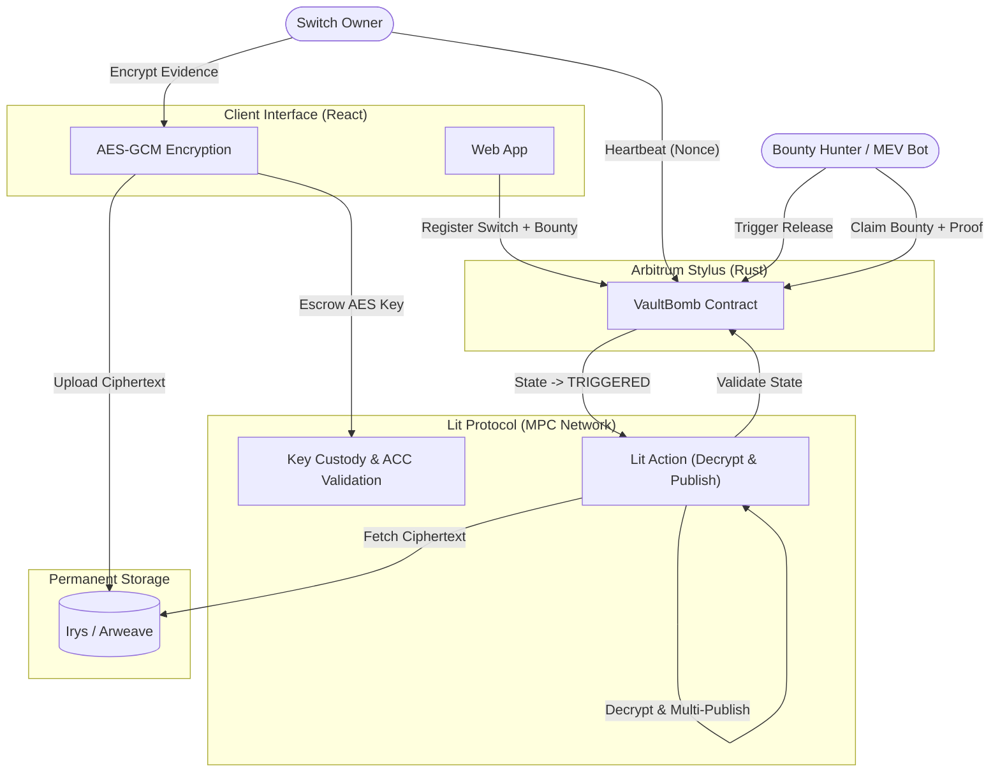
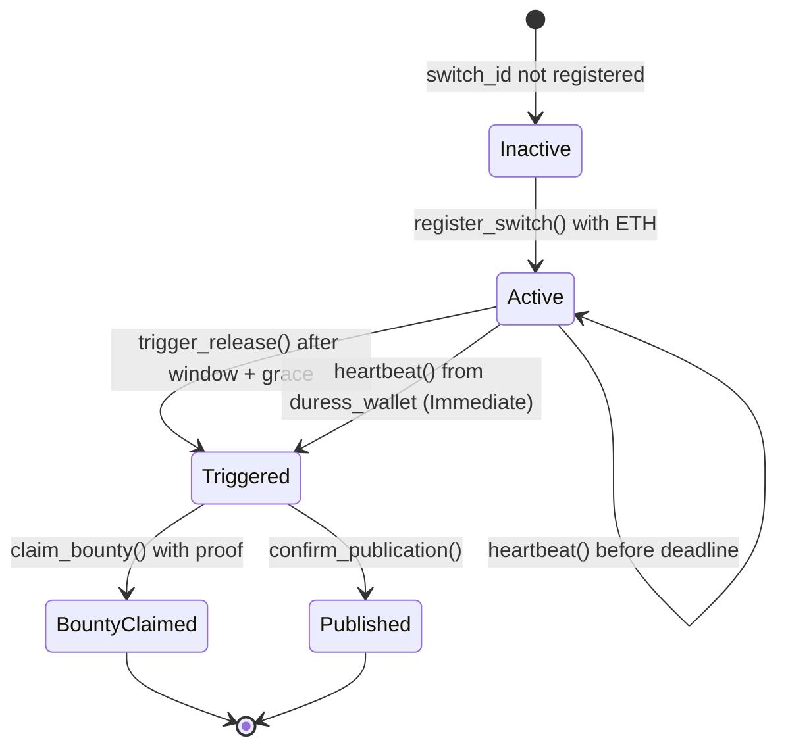
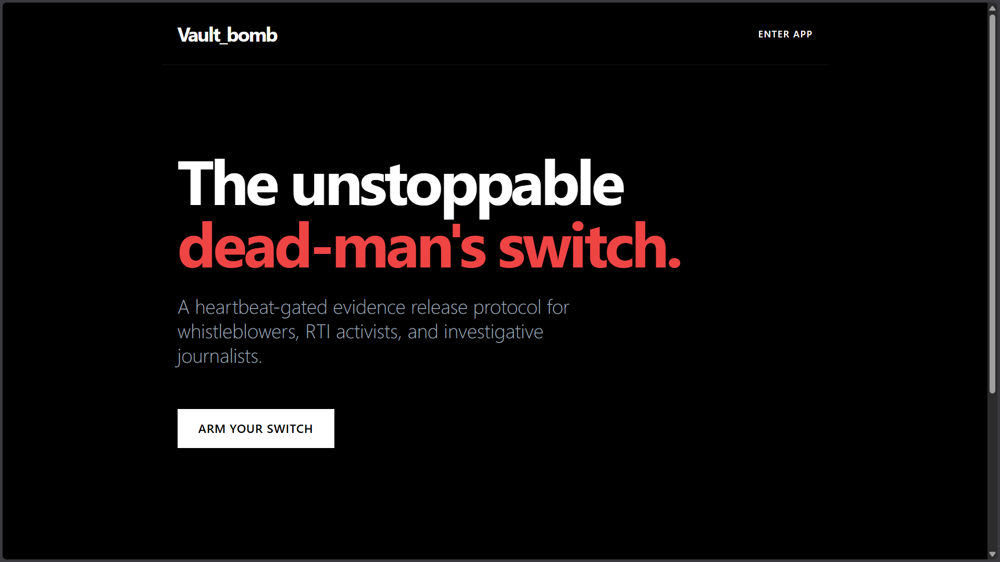
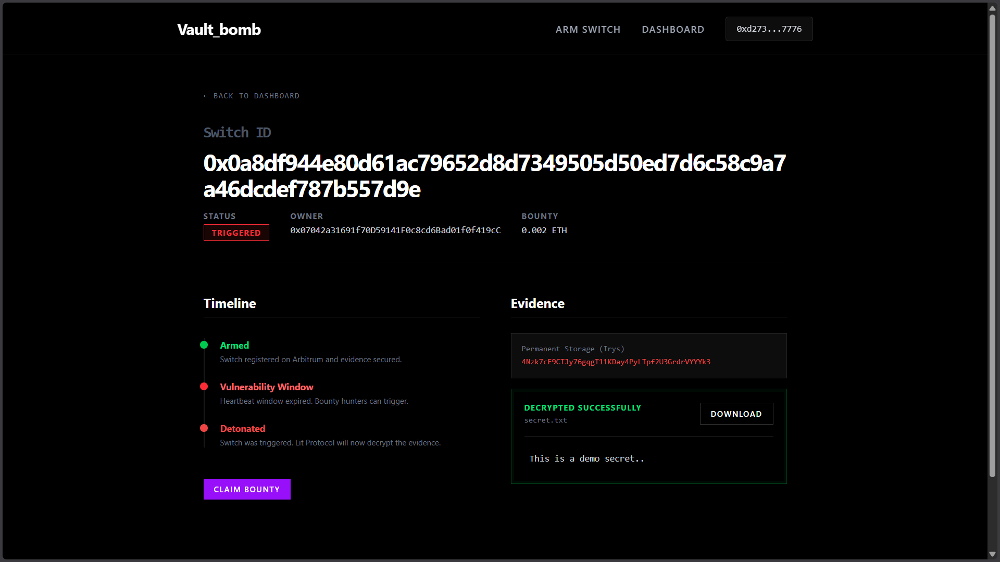
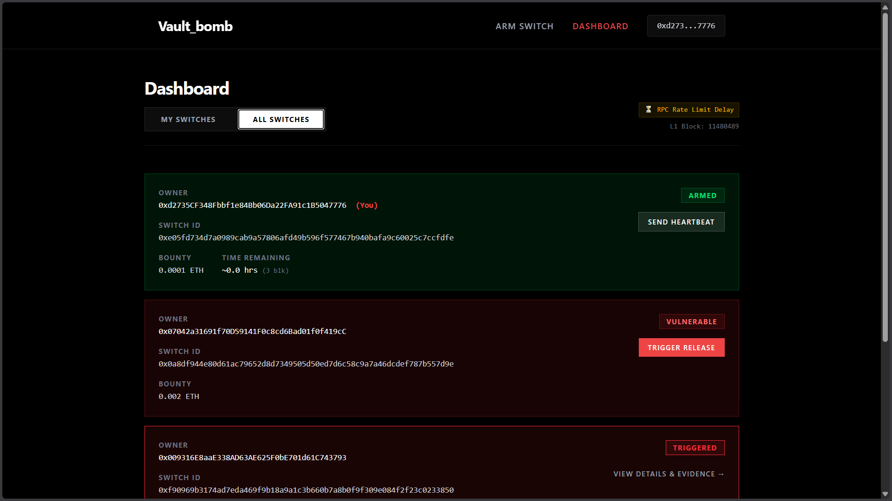
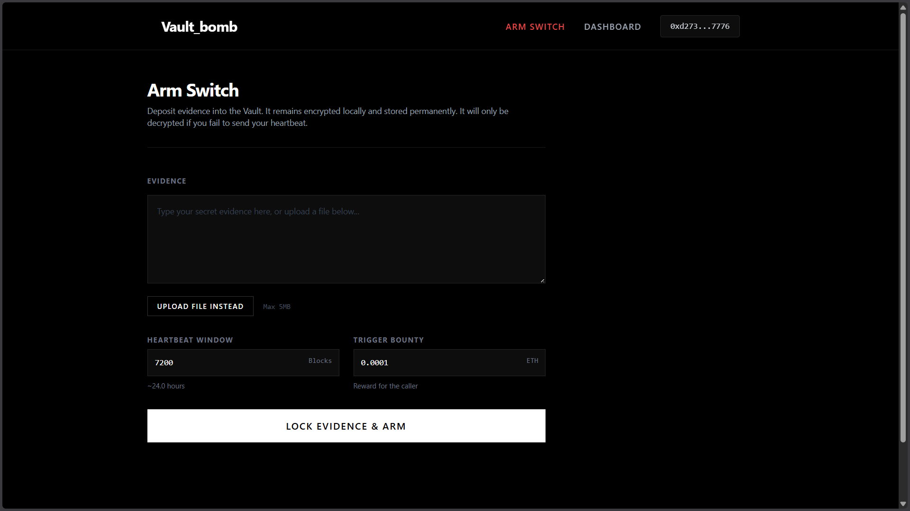
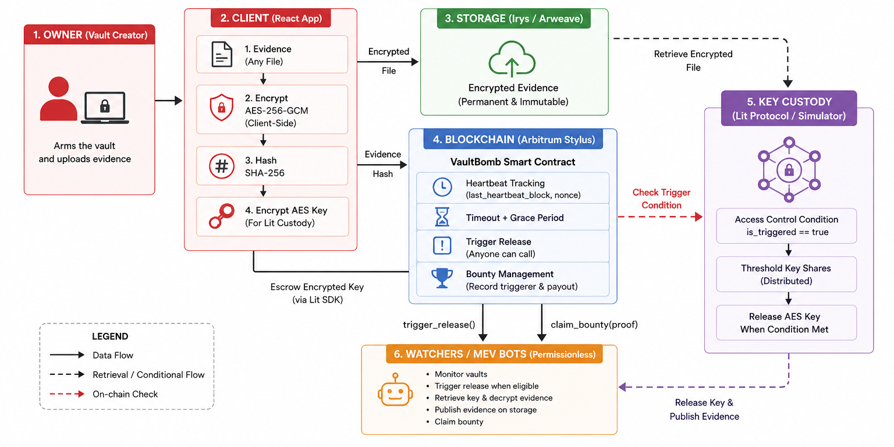

<div align="center">
  
  <h1>💣 Vault_bomb</h1>
  <p><strong>The Unstoppable Dead-Man's Switch for Whistleblowers, Activists & Investigative Journalists</strong></p>
</div>

<br/>

Vault Bomb is a decentralized evidence-release protocol that ensures critical information is published if the owner is silenced, coerced, or incapacitated. Built on Arbitrum Stylus, Irys/Arweave, and Lit Protocol architecture.

---

# Overview

Information suppression relies on coercing individuals. If an authoritarian regime or malicious entity wants to stop a release of classified information, they target the whistleblower or journalist holding it. Traditional dead-man's switches attempt to solve this by using timed emails or centralized servers, but these are fragile. A server can be seized, and centralized databases can be taken offline.

Vault Bomb shifts the critical condition from continued user action to an externally verifiable, on-chain time condition. It removes the individual and any centralized server as the point of failure. By leveraging permanent decentralized storage, decentralized key management, and immutable smart contracts on Arbitrum, Vault Bomb guarantees that once evidence is locked, its release cannot be stopped by targeting the creator.

---

# Problem Statement

Traditional dead-man's switches depend on a single identifiable party, server, or cloud service controlling the release process. 
- Timed emails or centralized servers can be seized or shut down by a legal order.
- Cloud providers can be subpoenaed to suspend service.
- Centralized databases represent a single point of failure.

The fundamental property Vault Bomb provides is that an adversary must simultaneously defeat three independently operating decentralized networks (on-chain logic, key custody, permanent storage) rather than a single hardened system. The system assumes the owner may be compelled to stop interacting with the protocol, shifting reliance to unstoppable smart contract execution.

---

# Core Concept

Vault Bomb allows an owner to create a "vault" containing encrypted evidence. 
1. **Arming:** The evidence is symmetrically encrypted locally. The ciphertext is uploaded to permanent storage (Irys/Arweave). The decryption key is escrowed in a custody layer. A smart contract switch is registered on Arbitrum with a heartbeat window and an ETH bounty.
2. **Monitoring (Heartbeat):** The owner must periodically submit a "heartbeat" transaction to the smart contract before the window expires, resetting the timer.
3. **Trigger:** If the heartbeat deadline and a short grace period elapse without a valid heartbeat, the vault becomes vulnerable. Any address can trigger the release and claim the attached ETH bounty.
4. **Release:** The trigger permanently changes the on-chain state. The custody layer verifies the trigger state, decrypts the ciphertext, and makes the plaintext public.

The explicit relationship is:

```text
Continued User Activity (Heartbeat)
        ↓
Vault Remains Safe
        ↓
Required State Updates
```

versus:

```text
Missing Required Activity
        ↓
Deadline Reached
        ↓
Vault Becomes Triggerable
```

---

# Key Features

- **On-chain vault registration:** Secure registration via an immutable Arbitrum Stylus contract.
- **Vault arming:** Client-side AES-256-GCM encryption before data leaves the browser.
- **Dead-man-switch mechanism:** Heartbeat-gated time window with an added block-based grace period.
- **Time-based state transitions:** Enforced entirely on-chain using L1 Ethereum block numbers.
- **Permissionless Trigger:** Any address globally can trigger an expired vault.
- **Bounty Incentivization:** Attached ETH bounty incentivizes MEV bots and watchers to execute the trigger.
- **Blockchain-backed state:** The smart contract is the authoritative source of truth.
- **Duress path:** A secondary wallet can immediately trigger the release while appearing as a normal heartbeat.
- **Arbitrum Stylus integration:** High-performance Rust smart contract compiled to WASM.
- **Publicly verifiable state:** Viewable by anyone via the watcher dashboard.

---

# Architecture

The system consists of independent layers, minimizing trust in any single component.


```mermaid
flowchart TB
    %% Entities
    Owner(["Switch Owner"])
    Bot(["Bounty Hunter / MEV Bot"])
    
    subgraph Client ["Client Interface (React)"]
        UI["Web App"]
        Crypto["AES-GCM Encryption"]
    end

    subgraph Chain ["Arbitrum Stylus (Rust)"]
        Contract["VaultBomb Contract"]
    end

    subgraph Custody ["Lit Protocol (MPC Network)"]
        KeyStore["Key Custody & ACC Validation"]
        Action["Lit Action (Decrypt & Publish)"]
    end

    subgraph Storage ["Permanent Storage"]
        Arweave[("Irys / Arweave")]
    end

    %% Setup Flow
    Owner -- "Encrypt Evidence" --> Crypto
    Crypto -- "Upload Ciphertext" --> Arweave
    Crypto -- "Escrow AES Key" --> KeyStore
    UI -- "Register Switch + Bounty" --> Contract
    
    %% Operation Flow
    Owner -- "Heartbeat (Nonce)" --> Contract
    
    %% Trigger Flow
    Bot -- "Trigger Release" --> Contract
    Contract -- "State -> TRIGGERED" --> Action
    Action -- "Validate State" --> Contract
    Action -- "Fetch Ciphertext" --> Arweave
    Action -- "Decrypt & Multi-Publish" --> Action
    Bot -- "Claim Bounty + Proof" --> Contract
```

### Trust boundaries:
- **On-chain:** Vault state, timing logic, trigger condition, and bounty (Arbitrum).
- **Off-chain, Permanent:** Encrypted evidence (Irys/Arweave).
- **Off-chain, Custody:** AES Decryption key (Lit Simulator MVP).
- **User-controlled:** Client-side encryption, private keys.

---

# Architecture Components

## Frontend
- **Framework:** React + Vite + TypeScript + TailwindCSS.
- **Responsibilities:**
  - Client-side AES-256-GCM encryption (`services/crypto.ts`). No plaintext ever leaves the browser.
  - Generates cryptographically secure `switchId`.
  - Interacts with Irys/Arweave for storage upload.
  - Communicates with Lit custody layer.
  - Interacts with Arbitrum Stylus contract via `ethers.js`.
  - Watcher dashboard for checking switch states and executing permissionless triggers.

## Smart Contract
- **Purpose:** On-chain enforcement of switch state, heartbeat timing, and trigger authorization.
- **Language:** Rust (Arbitrum Stylus).
- **Logic:**
  - Maintains registry of active vaults and their deadlines.
  - Enforces replay-protected heartbeats via nonces.
  - Uses L1 block numbers for strict time accounting.
  - Disburses ETH bounty upon verified trigger.

## Blockchain Layer
- **Network:** Arbitrum Sepolia (Testnet).
- **Functionality:** Provides cheap, fast EVM-compatible execution while inheriting Ethereum L1 security. The contract relies on L1 block numbers (`block.number`) to avoid L2 sequencer timestamp manipulation.

## Key Custody (MVP)
- **Current MVP:** `lit-simulator` (Node.js/Express)
- **Role:** Simulates Lit Protocol threshold network. It securely stores the AES key and decrypts the Arweave ciphertext upon verifying a triggered state.
- **Note:** In production, this is handled by Lit Protocol Programmable Key Pairs (PKPs) and Lit Actions, eliminating the centralized simulator server.

---

# Vault Lifecycle

```text
Created
   ↓
Registered
   ↓
Armed
   ↓
Active
   ↓
Updated / Maintained (Heartbeats)
   ↓
Deadline Approaches & Lapses
   ↓
Triggered
   ↓
Final State (Decrypted, Published & Bounty Claimed)
```

- **Created/Armed:** Owner encrypts data and escrows keys.
- **Registered:** Smart contract initialized with bounty and deadline.
- **Active:** Owner periodically calls `heartbeat()`.
- **Triggered:** Window elapses; external caller invokes `trigger_release()`.
- **Final State:** Keys are released, ciphertext is decrypted, and bounty is claimed.

---

# Detailed State Machine


```mermaid
stateDiagram-v2
    [*] --> Inactive : switch_id not registered
    Inactive --> Active : register_switch() with ETH
    Active --> Active : heartbeat() before deadline
    Active --> Triggered : trigger_release() after window + grace
    Active --> Triggered : heartbeat() from duress_wallet (Immediate)
    Triggered --> BountyClaimed : claim_bounty() with proof
    Triggered --> Published : confirm_publication()
    BountyClaimed --> [*]
    Published --> [*]
```

- **Inactive:** Vault does not exist.
- **Active:** Vault is armed. Heartbeats increment the L1 block timer.
- **Triggered:** The deadline lapsed, and an external actor invoked the trigger. State is irreversible.
- **BountyClaimed:** The actor who triggered the vault provided proof of publication and claimed the ETH reward.
- **Published:** The evidence is decrypted and publicly accessible.

---

# How the Dead-Man Switch Works

The timing logic relies on on-chain execution and blockchain primitives:

1. **Initial Deadline:** Set upon calling `register_switch()`, establishing a window in L1 blocks.
2. **Resetting:** Calling `heartbeat()` with a strictly increasing nonce resets the `last_heartbeat_block` to the current `block.number`.
3. **Evaluation:** When `trigger_release()` is called, the contract evaluates: `current_block > last_heartbeat_block + heartbeat_window + grace_period`.
4. **Trigger:** If the condition evaluates to true, the contract transitions the state to triggered. The first caller's address is recorded to receive the bounty.
5. **Decentralized Execution:** There is no centralized cron job. The ETH bounty incentivizes MEV bots or interested parties to continuously monitor the blockchain and invoke the trigger function immediately upon expiration.
6. **Grace Period:** A hardcoded buffer of L1 blocks prevents accidental triggers during transient network or RPC failures.

---

# Blockchain and Arbitrum

- **Network:** Arbitrum Sepolia (Testnet)
- **Contract Language:** Rust (compiled to WASM via Stylus)
- **Contract Address:** `0x0c92d14eea513a216ab1559deac8e0ce8fabc3b9`
- **Why Arbitrum Stylus?** Stylus allows the contract to be implemented in memory-safe Rust while maintaining EVM interoperability. It offers orders-of-magnitude cheaper compute for managing large mapping arrays and strict block-timing logic.
- **Timing Constraint:** Arbitrum inherits L1 Ethereum block numbers. Vault Bomb explicitly uses L1 block numbers rather than `block.timestamp` to prevent L2 sequencer timestamp manipulation.

---

# Smart Contract

**Contract Name:** `VaultBomb`

| Function | Purpose | Caller | State-changing |
| -------- | ------- | ------ | -------------- |
| `register_switch` | Initializes vault, sets parameters, deposits bounty | Anyone | Yes |
| `heartbeat` | Resets the countdown timer | Registered/Backup Wallet | Yes |
| `trigger_release` | Activates trigger if deadline is met | Anyone (Permissionless)| Yes |
| `claim_bounty` | Transfers ETH to triggerer | Triggerer | Yes |
| `confirm_publication` | Emits `PlaintextPublished` event | Triggerer | Yes |
| `get_switch_info` | Read-only view of vault state | Public | No |
| `initialize_lit_pubkey`| Registers the Lit Action public key | Deployer | Yes |
| `check_upkeep` | Keeper-compatible interface for monitoring triggers | Public | No |
| `perform_upkeep` | Keeper-compatible trigger execution | Public | Yes |

---

# Security Model

## Threat Model
Vault Bomb is designed to address:
- **Forced inactivity:** The core premise. If the owner is prevented from interacting with the system, the smart contract ensures release.
- **Single provider subpoena:** Evidence is encrypted before upload. The ciphertext resides permanently on Arweave. 
- **Trigger suppression:** Because `trigger_release()` is permissionless and incentivized, an adversary cannot shut down a centralized trigger server to stop execution.
- **Accidental trigger (RPC failure):** The grace period protects against temporary inability to send a heartbeat.
- **L2 Sequencer manipulation:** Prevented by using L1 block numbers for time accounting.
- **Heartbeat Replay:** Mitigated via strictly increasing nonces for `heartbeat()` calls.
- **Coercion (Duress):** Using the designated `duress_wallet` to send a heartbeat immediately triggers the vault, bypassing the time window while appearing identical to a standard heartbeat.

## Trust Model
```text
User 
  ↓ (Trusts Local Encryption)
Browser
  ↓ (Trusts Wallet Provider)
Wallet
  ↓ (Trusts Blockchain RPC)
Arbitrum Stylus (Trust-minimized logic enforcement)
```

## Known Security Limitations
- **MVP Key Custody (Lit Simulator):** The current `lit-simulator` implementation stores AES keys on a Node.js backend. The `/get-key` endpoint does not enforce cryptographic Access Control Conditions (ACC). In a production deployment, this entire layer is replaced by Lit Protocol's threshold network, which cryptographically enforces the on-chain `is_triggered` state.
- **Testnet Deployment:** Currently deployed on Arbitrum Sepolia.
- **Switch ID persistence:** The `switchId` is stored in the browser's `localStorage`. If the user clears browser data without a backup, the local reference to the vault is lost.
- **Bounty Proof (MVP):** The current bounty claim proof is a deterministic 65-byte string. Production relies on a true Lit Action ECDSA signature.

---

# Data Flow

### On-chain data
- `is_active`, `is_triggered`, `bounty_claimed`
- Registered wallet, Duress wallet, Backup wallet, Triggerer wallet
- Heartbeat window, grace period, last heartbeat block, last nonce
- Arweave Transaction ID, Evidence SHA-256 Hash
- ETH Bounty amount

### Off-chain data
- **Encrypted Ciphertext:** Resides permanently on Irys/Arweave.
- **AES-256-GCM Key:** Escrowed in the Lit Simulator (Production: Lit Protocol).

### User-controlled data
- Plaintext evidence (never leaves the client unencrypted).
- Cryptographically secure `switchId` (stored locally).

### Derived state
- Trigger eligibility is calculated dynamically by comparing the current L1 block against `last_heartbeat_block + window + grace`.

---

# Repository Structure

```text
vault-bomb/
├── client/                     # Test scripts and client setup
├── contracts/                  # Arbitrum Stylus smart contract (Rust)
│   ├── src/                    # Contract logic (lib.rs, main.rs)
│   └── deploy.sh               # Deployment script
├── frontend/                   # React web application
│   ├── src/                    
│   │   ├── pages/              # App views (Dashboard, Register, etc.)
│   │   ├── services/           # Crypto, Lit, Irys integrations
│   │   └── contracts/          # Ethers.js ABI wrappers
│   └── package.json
├── lit-simulator/              # Mock Lit Protocol backend (Node.js/Express)
├── architecture.md             # In-depth architectural documentation
└── README.md                   # This file
```

---

# Technology Stack

| Layer          | Technology | Role                        |
| -------------- | ---------- | --------------------------- |
| Smart Contract | Rust       | Arbitrum Stylus WASM logic  |
| Blockchain     | Arbitrum   | Secure, cheap on-chain execution |
| Storage        | Irys/Arweave| Permanent encrypted ciphertext hosting |
| Key Custody    | Node.js / Lit| Lit Simulator / Protocol threshold network |
| Frontend       | React/Vite | User interface and local encryption |
| Web3           | Ethers.js  | Wallet and RPC interaction |

---

# Prerequisites

- Node.js (v18+)
- npm or yarn
- Rust toolchain (`cargo`)
- `cargo stylus` CLI
- MetaMask or compatible Web3 wallet
- Arbitrum Sepolia ETH (for testnet transactions)

---

# Installation

Clone the repository:
```bash
git clone https://github.com/Amrit-mishra07/Vault_bomb.git
cd Vault_bomb
```

Install frontend dependencies:
```bash
cd frontend
npm install
```

Install simulator dependencies (if testing locally):
```bash
cd ../lit-simulator
npm install
```

---

# Environment Configuration

### Frontend
Create a `.env` file in the `frontend/` directory based on `.env.example`:

```env
VITE_CONTRACT_ADDRESS=0x0c92d14eea513a216ab1559deac8e0ce8fabc3b9
VITE_LIT_RPC_URL=https://yellowstone-rpc.litprotocol.com
VITE_LIT_SIMULATOR_URL=http://localhost:3000
```

| Variable | Required | Purpose |
| -------- | -------- | ------- |
| `VITE_CONTRACT_ADDRESS` | Yes | Address of the Arbitrum Stylus contract |
| `VITE_LIT_RPC_URL` | No | Real Lit Protocol RPC (for future integration) |
| `VITE_LIT_SIMULATOR_URL` | Yes | URL for the Lit simulator backend |

---

# Running Locally

You will need to run the frontend and the Lit Simulator simultaneously for local testing.

1. **Start the Lit Simulator:**
```bash
cd lit-simulator
node index.js
```
*Ensure `VITE_LIT_SIMULATOR_URL` in your frontend `.env` points to `http://localhost:3000`.*

2. **Start the Frontend:**
```bash
cd frontend
npm run dev
```

---

# Deployment

### Smart Contract
To deploy the Rust smart contract to Arbitrum Sepolia:

1. Configure your deployer wallet private key.
2. Build and check the Stylus contract:
```bash
cd contracts
cargo stylus check
```
3. Deploy:
```bash
cargo stylus deploy -e <YOUR_PRIVATE_KEY> --rpc https://sepolia-rollup.arbitrum.io/rpc
```
4. Record the deployed contract address and update `VITE_CONTRACT_ADDRESS` in the frontend `.env`.

### Frontend
The frontend can be built and deployed statically using Vite:
```bash
cd frontend
npm run build
```
The output in `dist/` can be deployed to Vercel, Netlify, or IPFS.

---

# Usage Workflow

1. **Connect Wallet:** Access the frontend and connect your Web3 wallet (Arbitrum Sepolia).
2. **Register a Vault:** Select the evidence file, define the heartbeat window (in L1 blocks), and provide the ETH bounty.
3. **Arm the Vault:** The frontend locally encrypts the data, escrows the AES key to the custody layer, uploads the ciphertext to Irys, and registers the switch on-chain.
4. **Maintain (Heartbeat):** Periodically visit the dashboard and submit a heartbeat transaction to reset the timer.
5. **Detonation:** If the deadline passes without a heartbeat, any user can click "Execute Trigger" on the public dashboard to invoke `trigger_release()`.
6. **Publication & Claim:** The triggerer simulates the decryption process, which produces the plaintext and a proof. The triggerer then submits the proof via `claim_bounty()` to claim the ETH reward.

---

# Example Workflow

- **User Action:** A journalist registers a vault with a 7200 L1 block heartbeat window (approx. 24 hours) and a 0.1 ETH bounty.
- **Frontend Action:** The payload is AES-256-GCM encrypted and uploaded to Arweave. The key is sent to the Lit Simulator.
- **Wallet Transaction:** `register_switch()` is called with 0.1 ETH value.
- **Maintenance:** The journalist calls `heartbeat()` every 12 hours.
- **Trigger:** The journalist fails to call `heartbeat()`. The window + grace period expires.
- **Result:** An MEV bot detects the expired switch, calls `trigger_release()`, uses the triggered state to fetch the key from the custody layer, decrypts the evidence, and claims the 0.1 ETH bounty.

---

# Screenshots

<details>
<summary>Click to view images</summary>

### Application Views

<br/>
<br/>

<br/>
<br/>

<br/>
<br/>

<br/>
<br/>

**Architecture Reference:**
<br/>


</details>

---

# Performance and Timing

Because Vault Bomb is heavily time-dependent, note the following distinctions:
- **Arbitrum block production time:** ~0.25 seconds (L2 sequencer).
- **Contract timestamp:** The contract strictly uses L1 Ethereum block numbers (`block.number`), which update roughly every 12 seconds.
- **Vault deadline:** Calculated dynamically in L1 blocks. 
- **Grace period:** The MVP default grace period is 20 L1 blocks (approx. 4 minutes), ensuring transient RPC failures do not result in accidental detonations.

---

# Failure Modes

- **Wallet disconnected / user rejects:** Transaction is cancelled; vault state remains unchanged.
- **RPC unavailable:** User cannot send heartbeat. The 20-block grace period protects against temporary outages.
- **Vault deadline expires:** The vault enters a vulnerable state where any address can trigger it.
- **Lit Simulator stops:** Decryption cannot occur (MVP limitation). In production, Lit Protocol guarantees uptime via its decentralized threshold network.
- **Contract call reverts:** Malformed heartbeats (e.g. invalid nonce) or premature trigger attempts revert securely without altering state.

---

# Limitations

- **Testnet Deployment:** Currently relies on Arbitrum Sepolia infrastructure.
- **Lit Simulator Gap:** The current key custody backend is a centralized Node.js simulator lacking true cryptographic ACC enforcement. This is strictly for demonstration until full Lit Protocol PKP integration.
- **Frontend Availability:** The web interface relies on standard web hosting.
- **No Production Audit:** The smart contract has not been formally audited. Do not use with mainnet funds or real sensitive data yet.

---

# Development Guide

- **Smart Contract (`contracts/`):** Written in Rust using the Stylus SDK. Focus on `lib.rs` for state and logic. Changes require `cargo stylus check`.
- **Frontend (`frontend/`):** React SPA. The cryptographic logic lives in `src/services/crypto.ts`. Contract interactions are wrapped in `src/contracts/VaultBomb.ts`.
- **Backend/Custody (`lit-simulator/`):** Express server mapping Lit Protocol endpoints for test environments.

---

# Design Decisions

- **Why Arbitrum Stylus?** The need for robust on-chain execution with complex mappings and low fees made Stylus ideal. Rust provides safety and gas efficiency via WASM compilation.
- **Why L1 Block Timing?** Relying on L2 `block.timestamp` is susceptible to sequencer manipulation. Inheriting L1 block numbers provides robust external time enforcement.
- **Why an ETH Bounty?** Replacing a centralized trigger cron-job with a permissionless, financial incentive ensures the free market (MEV bots/bounty hunters) will execute the release securely.
- **Trust Minimization:** Vault Bomb separates data storage (Arweave), key custody (Lit), and execution logic (Arbitrum) to prevent any single entity from halting a release.

---

# Architecture Documentation

For a comprehensive deep dive into the system's design goals, threat model, trust assumptions, data flow, and complete sequence diagrams, see:

[**architecture.md**](./architecture.md)

---

# Team

- **Amrit Mishra** - *Group Leader* - [GitHub](https://github.com/Amrit-mishra07)
- **Abhay Gugale** - *Member* - [GitHub](https://github.com/IronAlpha3528)
- **Harsh Aghara** - *Member* - [GitHub](https://github.com/harsh-aghara)

---

# Contributing

1. Fork the repository.
2. Create a feature branch (`git checkout -b feature/amazing-feature`).
3. Make your changes.
4. Ensure Rust checks pass (`cargo clippy` in `contracts/`).
5. Commit changes (`git commit -m 'Add amazing feature'`).
6. Push to the branch (`git push origin feature/amazing-feature`).
7. Open a pull request.

---

# License

This project is licensed under the [MIT License](./LICENSE). Built for the greater good.
