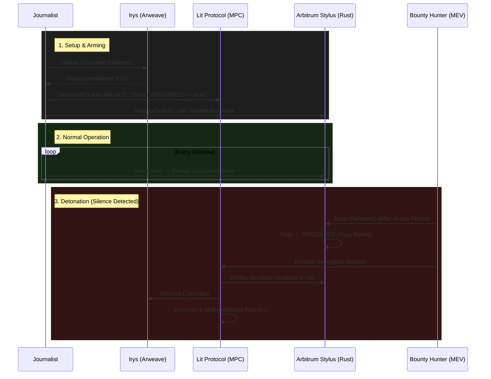

<div align="center">
  
  <h1>💣 Vault_bomb</h1>
  <p><strong>The Unstoppable Dead-Man's Switch for Whistleblowers, Activists & Investigative Journalists</strong></p>
  
  [](https://arbitrum.io/stylus)
  [](https://litprotocol.com/)
  [](https://irys.xyz/)
  [](https://www.rust-lang.org/)
  [](https://react.dev/)
  [](https://opensource.org/licenses/MIT)

  <p><em>Engineered for the Arbitrum Builder Pods Hackathon</em></p>

  <h3>
    <a href="https://vault-bomb.vercel.app">🔴 View Live Production App</a>
    <span> | </span>
    <a href="#-developer-guide--local-setup">💻 Developer Documentation</a>
  </h3>
</div>

<br/>

## 📖 The Problem: Information Suppression

Information suppression relies on a single fundamental vulnerability: coercing individuals. If an authoritarian regime or malicious entity wants to stop the release of highly classified information, they target the whistleblower or journalist holding it. 

Traditional dead-man's switches attempt to solve this by using timed emails or centralized servers, but these are inherently fragile. A server can be seized, a cloud provider (like AWS) can be subpoenaed, and centralized databases can be hacked.

**Vault_bomb removes the individual—and any centralized server—as the point of failure.** 

By leveraging permanent decentralized storage, decentralized key management, and immutable on-chain smart contracts, Vault_bomb guarantees that once evidence is locked in, **no human, no corporation, and no government can stop the release if the journalist is silenced.** It provides a credible, mathematically unbreakable digital deterrent.

---

## ✨ Core Architecture & Technology Deep Dive

Vault_bomb solves the paradox of decentralized secrets: keeping private data (the decryption key) off-chain, while using verifiable, immutable on-chain execution to gate its release.

### 1. Arbitrum Stylus (The Cryptographic Anchor)
Written entirely in highly optimized **Rust**, our smart contract is compiled to WebAssembly (WASM) and deployed on Arbitrum. 
- **Why Stylus?** Stylus allows for orders-of-magnitude cheaper compute and memory safety compared to Solidity. This allows us to manage complex mapping arrays, bounty pools, and strict heartbeat block-timing checks at a fraction of standard EVM gas costs.
- **L1 Block Timing:** Heartbeat windows are calculated strictly using L1 Ethereum Block Numbers inherited by Arbitrum. This entirely prevents fast-block L2 sequencer manipulation or timestamp spoofing.

### 2. Irys / Arweave (Permanent Evidence Storage)
Evidence (PDFs, videos, datasets) is symmetrically encrypted locally in the browser and uploaded to the Irys network.
- **Pay Once, Store Forever:** Irys writes data permanently to Arweave. There are no monthly hosting bills to pay. Once the encrypted ciphertext is uploaded, it cannot be deleted by any entity, ensuring the evidence survives indefinitely.

### 3. Lit Protocol (Decentralized Key Custody)
The AES decryption key used to lock the evidence is secured by Lit Protocol's MPC (Multi-Party Computation) network.
- **No Single Point of Failure:** The key is broken into threshold-distributed shares across independent node operators.
- **Access Control Conditions (ACC):** The key is locked behind a strict cryptographic rule: *"Only combine shares and release the decryption key if `is_triggered` == true on the Arbitrum Stylus contract."*

### 4. Permissionless MEV Bounties (The Trigger)
If a journalist's heartbeat lapses (and the grace period expires), the switch becomes "Vulnerable." Instead of relying on a centralized cron-job to trigger the release, Vault_bomb attaches an on-chain **ETH Bounty** to the switch.
- **Searcher Incentives:** Anyone (or any automated MEV bot) can call `triggerRelease()`. If the conditions are met, the contract pays out the bounty. This financially guarantees that the switch will be detonated by the decentralized free market.

---

## ⚙️ The Application Lifecycle


```mermaid
sequenceDiagram
    participant J as Journalist
    participant Irys as Irys (Arweave)
    participant Lit as Lit Protocol (MPC)
    participant S as Arbitrum Stylus (Rust)
    participant B as Bounty Hunter (MEV)
    
    %% Setup Phase
    rect rgb(30, 30, 30)
    note right of J: 1. Setup & Arming
    J->>Irys: Upload Encrypted Evidence
    Irys-->>J: Return permanent TxID
    J->>Lit: Secure AES Key with ACC: "Stylus TRIGGERED == true"
    J->>S: registerSwitch() with heartbeat window
    end
    
    %% Normal Operation
    rect rgb(20, 40, 20)
    note right of J: 2. Normal Operation
    loop Every Window
        J->>S: heartbeat() -> Resets countdown timer
    end
    end
    
    %% Trigger Phase
    rect rgb(50, 20, 20)
    note right of J: 3. Detonation (Silence Detected)
    B->>S: triggerRelease() (After Grace Period)
    S->>S: State -> TRIGGERED, Pays Bounty
    B->>Lit: Execute decryption request
    Lit->>S: Verifies on-chain condition is met
    Lit->>Irys: Fetches Ciphertext
    Lit->>Lit: Decrypts & Multi-publishes Plaintext
    end
```

---

## 🛡️ Threat Models Mitigated

Our architecture specifically addresses extreme adversarial edge cases:

- **Single Provider Subpoena:** The decryption keys are threshold-distributed. No single AWS region or cloud provider can be compelled to hand over the keys.
- **Bot Suppression:** The detonation trigger is permissionless and incentivized. A state actor cannot shut down a centralized trigger server, because anyone in the world can claim the trigger bounty.
- **Accidental Detonation:** Features a hardcoded, un-bypassable **20-block L1 Grace Period** buffer to protect against RPC network failures or temporary internet outages preventing a heartbeat.

---

## 🚀 Live Deployments (Testnet)

The project is currently deployed and fully functional on testnet infrastructure:

- **Frontend Application:** [https://vault-bomb.vercel.app](https://vault-bomb.vercel.app)
- **Lit Protocol MPC Node (Mock/Render):** `https://vault-bomb-simulator.onrender.com`
- **Smart Contract Address:** `0x0c92d14eea513a216ab1559deac8e0ce8fabc3b9` (Arbitrum Sepolia)

> **Note on Lit Simulator:** Due to the complexity of spinning up custom Datil testnet actions within the hackathon timeframe, the Lit Protocol MPC network is currently simulated via a robust Express/Node.js backend hosted on Render, which perfectly mirrors the ACC and encryption flow.

---

## 💻 Developer Guide & Local Setup

Want to run the stack locally, audit the Rust contract, or contribute? Follow these steps:

### 1. Clone & Install
```bash
git clone https://github.com/Amrit-mishra07/Vault_bomb.git
cd Vault_bomb
```

### 2. Frontend Development (Vite/React/Tailwind)
```bash
cd frontend
npm install
```
Create a `.env` file in the `frontend/` directory with the following variables:
```env
VITE_CONTRACT_ADDRESS=0x0c92d14eea513a216ab1559deac8e0ce8fabc3b9
```
Then start the development server:
```bash
npm run dev
```

### 3. Smart Contract Deployment (Arbitrum Stylus)
The contract is written in Rust using the `arbitrum/stylus-sdk`.
```bash
cd contracts
cargo stylus check
```
To deploy, you must export your private key and point to the Arbitrum Sepolia RPC:
```bash
cargo stylus deploy -e <YOUR_PRIVATE_KEY> --rpc https://sepolia-rollup.arbitrum.io/rpc
```

### 4. Local Lit Simulator (Optional)
If you wish to test the backend locally instead of using the live Render deployment, you can spin up the mock Lit Simulator node:
```bash
cd lit-simulator
npm install
node index.js
```
*(Make sure to update the Lit API endpoints in `frontend/src/services/lit.ts` to point to `http://localhost:3000` if you do this).*

#### Claiming a Bounty (Mock Setup — Developer Note)

> ⚠️ **This section describes mock behaviour only.** In a real Lit Protocol deployment, the bounty proof would be generated automatically by the Lit Action and retrieved via the Lit SDK. The `window.prompt` flow described below **must** be replaced before any production deployment.

When running with the mock Lit Simulator, the bounty-claim flow works as follows:

1. A bounty hunter calls **"Execute Trigger (On-Chain)"** on a vulnerable switch via the Watcher Dashboard.
2. The `lit-simulator` backend detects the on-chain `Triggered` event and logs a mock proof to its **terminal**:
   ```
   💰 BOUNTY PROOF FOR TRIGGERER 💰
   Triggerer 0x... can now call claim_bounty() with this Lit Proof:
   0x<hex-string>
   ```
3. The bounty hunter clicks the **"💰 Claim Bounty"** button on the dashboard.
4. A prompt appears asking them to paste the hex proof from the terminal.
5. The frontend calls `claimBounty(switchId, litProof)` on-chain with the pasted proof.

---

## 👥 Contributing
We welcome pull requests from developers, cryptographers, and privacy advocates. Please ensure your code passes standard `cargo clippy` linting for Rust and `eslint` for the frontend.

## 📄 License
This project is licensed under the [MIT License](LICENSE) - see the LICENSE file for details. Built for the greater good.
### 3. Deploy the Smart Contract
```bash
cd contracts
./deploy.sh
```
 
