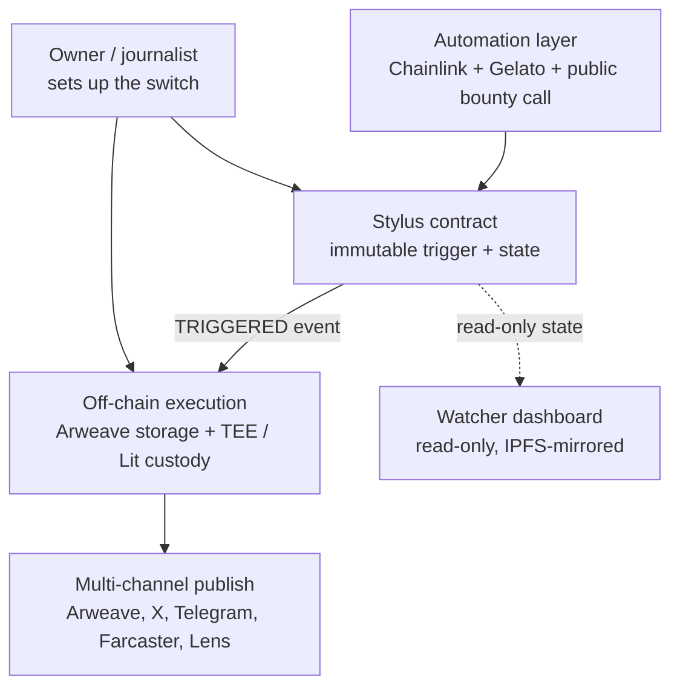

# Architecture — Unstoppable Dead-Man's Switch

A heartbeat-gated evidence release protocol for whistleblowers, RTI activists, and investigative journalists. This document is the standalone architecture reference for the codebase — see `deadmans_switch_technical_spec.md` for full rationale, threat modeling, and edge-case analysis.

## 1. System Overview

The protocol has four independent layers, each with its own trust model, so that no single compromised or coerced party can suppress a release:

| Layer | Component | Role |
|---|---|---|
| Logic | Arbitrum Stylus contract | Immutable heartbeat/trigger state machine |
| Automation | Chainlink Upkeep + Gelato + permissionless `triggerRelease()` | Fires the trigger when the heartbeat window expires |
| Custody & compute | TEE on EigenCloud (MVP) → Lit Protocol PKP/Lit Action (Phase 2) | Holds the decryption key, decrypts on valid trigger, publishes |
| Storage | Arweave | Permanent ciphertext and plaintext storage |

Design principle: for a release to be suppressed, an adversary must simultaneously defeat automation, custody, *and* storage — three independently-failing layers, not one hardened system.

## 2. Component Diagram



## 3. Repository Layout (suggested)

```
deadmans-switch/
├── contracts/                 # Arbitrum Stylus contract (Rust)
│   ├── src/
│   │   ├── lib.rs             # registerSwitch, heartbeat, triggerRelease
│   │   ├── state.rs           # switch state machine
│   │   └── bounty.rs          # bounty escrow logic
│   └── Cargo.toml
├── automation/
│   ├── chainlink/              # Upkeep job config + checkUpkeep/performUpkeep interface
│   └── gelato/                 # Gelato task config
├── custody/
│   ├── tee/                    # Phase 1: EigenCloud TEE service (listens for TRIGGERED, decrypts)
│   └── lit-actions/             # Phase 2: Lit Action JS, PKP minting scripts
├── publish/
│   └── channels/                # Arweave, Twitter/X, Telegram, email, Farcaster, Lens adapters
├── client/                      # Owner-facing setup client (encrypt, upload, register)
├── watcher/                      # Read-only dashboard (static site, IPFS-deployable)
├── deadmans_switch_technical_spec.md
├── deadmans_switch_build_todo.md
└── architecture.md              # this file
```

## 4. Data & Control Flow

### 4.1 Setup
1. Owner encrypts evidence (AES-256) → uploads ciphertext to Arweave (`txID_ciphertext`).
2. Owner sends the AES key + `txID_ciphertext` to the TEE/Lit Action over an attested channel; key never leaves custody.
3. TEE/Lit Action acknowledges key receipt (signed).
4. Only after acknowledgment: owner calls `registerSwitch()` with the heartbeat window, grace period, `txID_ciphertext`, `SHA-256(ciphertext)`, custody address, registered/backup/duress wallets.
5. Owner registers Chainlink Upkeep and Gelato jobs, funds the bounty escrow.

This ordering (ciphertext → key-into-custody → registration) is a required invariant: registration must never happen before custody confirms it holds the key.

### 4.2 Normal operation
- Owner calls `heartbeat(nonce)` from the registered (or backup) wallet every N days; nonce must be strictly increasing (replay protection).
- Automation checks the window on schedule; no action while the heartbeat is current.

### 4.3 Trigger
1. Window + grace period elapses.
2. Any of Chainlink, Gelato, or a public `triggerRelease()` caller (bounty-incentivized) flips contract state to `TRIGGERED` — first valid call wins, idempotent thereafter.
3. Contract emits `Triggered(switchId, txID_ciphertext, sha256Hash)`.
4. Custody layer verifies on-chain state, fetches ciphertext from Arweave, verifies hash, decrypts.
5. Custody layer publishes plaintext to Arweave (primary) and fans out to Twitter/X, Telegram/Signal, email, Farcaster, Lens in one execution.
6. Contract emits `PlaintextPublished(switchId, txID_plaintext)`; the watcher dashboard picks this up and flips status.

### 4.4 Duress path
- Heartbeat from the duress wallet bypasses the window and triggers release immediately.

## 5. Key Architectural Decisions

| Decision | Choice | Rationale |
|---|---|---|
| Contract upgradability | None — no proxy, no admin key, no pause | Any admin override defeats the "unstoppable" guarantee |
| Trigger automation | Layered: Chainlink (primary) + Gelato (secondary) + permissionless `triggerRelease()` (backstop) | No single automation vendor is a dependency |
| Backstop incentive | Bounty pool funded at registration, paid to first successful `triggerRelease()` caller | Turns permissionless triggering into a profit motive for bots/searchers, decoupled from publication |
| Key custody, Phase 1 | Single TEE (EigenCloud), sealed-disk key persistence | Realistic MVP scope; explicitly flagged as a single point of custody failure |
| Key custody, Phase 2 | Lit Protocol (PKP + Lit Action) preferred over custom multi-TEE | Existing threshold-custody network vs. bespoke cryptographic engineering |
| Publication | Multi-channel, executed inside the same custody execution (Lit Action) as decryption | Avoids a separate, independently-suppressible publisher process |
| Discovery | Read-only watcher dashboard, IPFS-mirrored, no keys/no write access | Uptime is a convenience, never a dependency |

## 6. Security Invariants (must hold in code, not just design)

- `triggerRelease()` has no access control beyond the on-chain time/window check — any address can call it.
- The contract has no function that can pause, upgrade, or redirect a registered switch after registration.
- `heartbeat()` requires `msg.sender == registeredWallet || msg.sender == backupWallet`, with strictly increasing nonce.
- Decryption inside custody only executes when the on-chain `TRIGGERED` condition is independently verified by the custody layer itself — never trusted from an off-chain caller's claim.
- Registration (`registerSwitch()`) must be causally dependent on a prior custody acknowledgment of key receipt (three-phase commit) — never allow ciphertext-and-registration-without-key.

## 7. Open Items Tracked Elsewhere

Full rationale, threat model, residual risk table, and unresolved design questions (Lit Protocol due diligence, bounty sizing, legal review of the duress mechanism, etc.) live in `deadmans_switch_technical_spec.md` §7–8 — this file intentionally stays implementation-focused.
