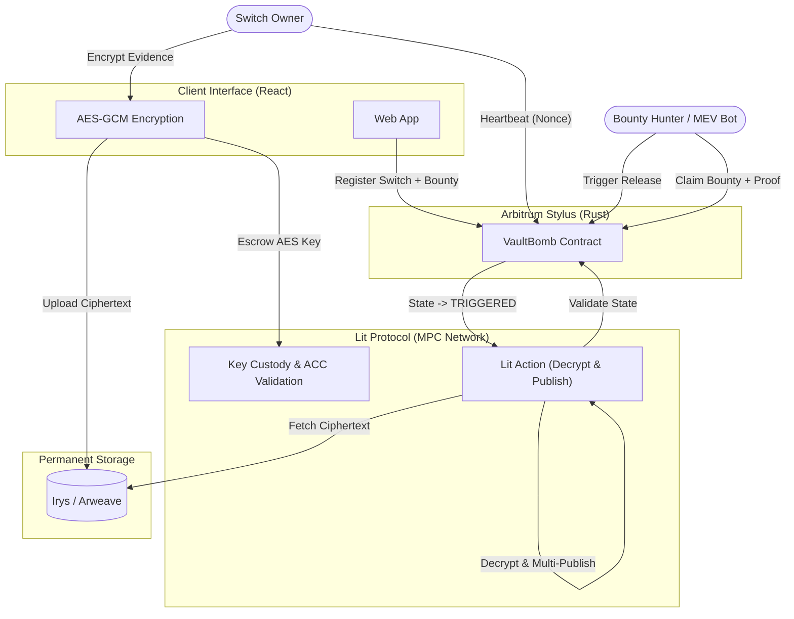
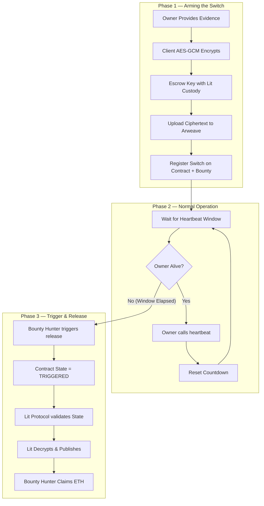
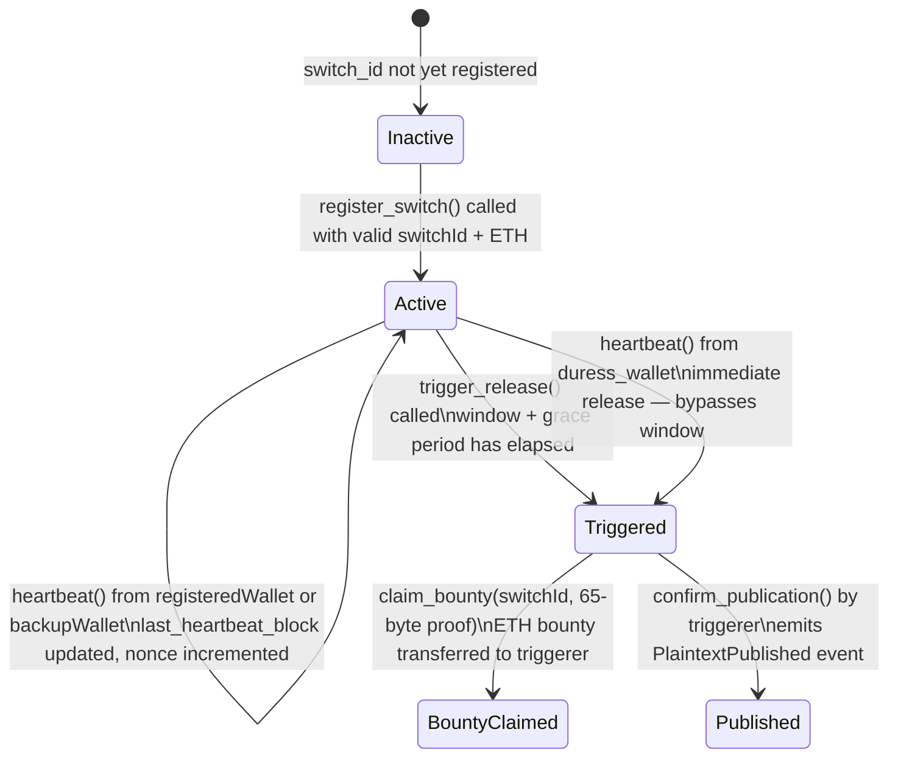

# Architecture — Vault_bomb

A heartbeat-gated, decentralized evidence-release protocol built on Arbitrum Stylus, Irys/Arweave, and Lit Protocol.

For project setup, live deployment links, and a general overview, see [`README.md`](./README.md).

---

## Table of Contents

1. [Problem Statement](#1-problem-statement)
2. [Design Goals](#2-design-goals)
3. [Technology Stack](#3-technology-stack)
4. [System Overview](#4-system-overview)
5. [Current Implementation Diagram](#5-current-implementation-diagram)
6. [Sequence Diagram — Full Lifecycle](#6-sequence-diagram--full-lifecycle)
7. [Repository Layout](#7-repository-layout)
8. [Data & Control Flow](#8-data--control-flow)
9. [On-Chain vs Off-Chain Data](#9-on-chain-vs-off-chain-data)
10. [Smart Contract — State Machine](#10-smart-contract--state-machine)
11. [Smart Contract — Functions & Events](#11-smart-contract--functions--events)
12. [Key Architectural Decisions](#12-key-architectural-decisions)
13. [Threat Model](#13-threat-model)
14. [Security Invariants](#14-security-invariants)
15. [Risk Register](#15-risk-register)
16. [Future Roadmap](#16-future-roadmap)

---

## 1. Problem Statement

Traditional dead-man's switches depend on a person, server, or service that controls the release process. If that component is compromised, disabled, or legally compelled to stop operating, the release mechanism fails.

Concretely:

- **Timed emails / centralized servers** — can be seized or shut down by a legal order targeting the operator.
- **Cloud-hosted services** — can be subpoenaed; the provider can be compelled to suspend the service or hand over data.
- **Centralized databases** — represent a single point of failure; a single legal order can halt the release.

In each case, the critical weakness is the same: a single identifiable party controls the release. Targeting that party is sufficient to suppress it.

---

## 2. Design Goals

Vault_bomb is designed to remove the single point of failure from the release mechanism.

**Core design principle:** To suppress a release, an adversary must simultaneously defeat three independently operating layers — on-chain logic, decentralized key custody, and permanent decentralized storage — rather than a single hardened system.

### How it works

1. **Arm:** The owner locally encrypts evidence (AES-256-GCM), uploads the ciphertext to Arweave via Irys, escrows the decryption key with a custody layer under an on-chain access condition, and registers a switch on an Arbitrum Stylus contract with a configurable heartbeat window and an ETH bounty.
2. **Stay alive:** The owner periodically calls `heartbeat()` to reset the countdown. Each call requires a strictly increasing nonce.
3. **Trigger:** If the heartbeat window plus grace period elapses without a valid `heartbeat()`, any address can call `triggerRelease()` and claim the ETH bounty. This replaces a centralized cron job with a permissionless, financially incentivized trigger.
4. **Release:** The custody layer independently verifies the on-chain triggered state, decrypts the ciphertext, verifies the evidence hash, and publishes the plaintext.

---

## 3. Technology Stack

| Layer | Technology | Notes |
|---|---|---|
| Smart contract | Arbitrum Stylus — Rust → WASM | Deployed on Arbitrum Sepolia at `0x0c92d14eea513a216ab1559deac8e0ce8fabc3b9` |
| Storage | Irys / Arweave | Pay-once permanent storage; encrypted ciphertext cannot be deleted after upload |
| Key custody — MVP | `lit-simulator` (Node.js/Express) | Functional mock of Lit Protocol; mirrors the same API surface without requiring Lit testnet deployment |
| Key custody — Production | Lit Protocol (PKP + Lit Actions) | Threshold-distributed MPC with on-chain Access Control Conditions (ACC) |
| Trigger mechanism | Permissionless `triggerRelease()` + ETH bounty | Any address can call; first valid caller receives the bounty |
| Frontend | React + Vite + TypeScript + TailwindCSS | Arm flow, watcher dashboard, per-switch detail view, heartbeat interface |
| Backend (custody sim) | Node.js / Express (`lit-simulator/index.js`) | Exposes `/store-key`, `/get-key/:switchId`, `/simulate-trigger`, `/get-proof/:switchId`, `/health` |
| Network | Arbitrum Sepolia (testnet) | L1 Ethereum block numbers used for heartbeat timing |

> **Lit Simulator note:** The production architecture is intended to use Lit Protocol for decentralized key custody and conditional release. Because deploying custom Lit Actions on the Lit testnet requires payment, the current MVP simulates this layer with a standalone Node.js/Express server (`lit-simulator/`) that mirrors the same API surface and cryptographic flow.

---

## 4. System Overview

The protocol operates across four independent layers. Each layer has a distinct failure domain.

| Layer | Current MVP | Production |
|---|---|---|
| **Logic** | Arbitrum Stylus contract (`contracts/src/lib.rs`) | Same — no upgrade path, no admin key |
| **Trigger** | Permissionless `triggerRelease()` + ETH bounty | Same |
| **Key custody** | `lit-simulator` — Node.js/Express | Lit Protocol (PKP + Lit Actions) |
| **Storage** | Irys → Arweave | Same |

### Component Responsibilities

#### Client / Frontend (`frontend/`)

**Purpose:**
Browser-based interface for the switch owner and for watchers/bounty hunters.

**Responsibilities:**
- Generates a cryptographically random `switchId` (`crypto.getRandomValues(32 bytes)` → `ethers.hexlify`)
- Encrypts evidence locally using AES-256-GCM before any network call
- Computes `SHA-256(plaintext)` = `evidenceHash` and passes it to the contract
- Uploads the encrypted JSON payload to Irys/Arweave
- POSTs `{switchId, aesKey, ciphertext, evidenceHash, journalistAddress}` to the custody layer
- Calls `register_switch()` on the Stylus contract with the Arweave TX ID, evidence hash, and ETH bounty
- Persists `switchId` to `localStorage` after registration
- Provides the watcher dashboard: reads `get_switch_info()`, calls `triggerRelease()`, calls `claim_bounty()`

**Interactions:**
Lit Simulator, Irys/Arweave, Stylus contract (via Ethers.js)

---

#### Encryption (`frontend/src/services/crypto.ts`)

**Purpose:**
Client-side AES-256-GCM encryption. Evidence is encrypted in the browser before leaving the device.

**Responsibilities:**
- Generates a 256-bit AES key
- Encrypts the plaintext evidence using AES-256-GCM with a random IV/nonce
- Produces a ciphertext payload (IV + ciphertext + GCM auth tag, base64-encoded)
- Computes `SHA-256(plaintext)` for on-chain commitment
- Exports the raw AES key in base64 for custody layer storage

---

#### Evidence Storage (Irys / Arweave)

**Purpose:**
Permanent, immutable storage for the encrypted ciphertext. Once uploaded, the data cannot be deleted.

**Responsibilities:**
- Receives the encrypted JSON payload `{secretCiphertext, iv, mimeType, fileName}` from the frontend
- Returns an `irysTxId` (Arweave transaction ID), which is stored on-chain in the contract
- Provides the ciphertext retrieval endpoint used by the custody layer at trigger time

**Interactions:**
Frontend (upload), Lit custody layer (retrieval on trigger)

---

#### Key Custody — MVP (`lit-simulator/index.js`)

**Purpose:**
During the current MVP, this Node.js/Express server simulates the behavior of a Lit Protocol MPC network. It stores the AES key and ciphertext, and performs decryption on trigger.

**Current implementation responsibilities:**
- `POST /store-key` — Accepts `{switchId, aesKey, ciphertext, evidenceHash, journalistAddress}` and persists to `keys.json` on disk. Returns a mock `litSignature`.
- `GET /get-key/:switchId` — Returns the raw AES key. **No on-chain state check is performed in the MVP.** This is an explicit security gap (see [Risk Register](#15-risk-register)).
- `POST /simulate-trigger` — Reconstructs the AES key, decrypts the ciphertext, verifies `SHA-256(plaintext) == evidenceHash`, writes the plaintext to disk, and returns a 65-byte mock bounty proof.
- `GET /get-proof/:switchId` — Returns the deterministic 65-byte proof: `sha256("PUBLISHED" + switchId)` repeated twice + `"00"`.
- `GET /health` — Keep-alive endpoint for the Render free-tier host.

**MVP gap:**
`/get-key` has no authentication. The production architecture replaces this endpoint entirely; key retrieval proceeds through the Lit SDK's threshold network, which cryptographically enforces the ACC (`is_triggered == true`).

---

#### Key Custody — Production (Lit Protocol)

**Planned architecture:**
The production implementation is intended to use Lit Protocol's PKP (Programmable Key Pair) and Lit Actions (WASM-executed JavaScript) for decentralized threshold key custody.

The Access Control Condition (ACC) will be:
*"Query `get_switch_info()` on the Stylus contract. Combine key shares and release the decryption key only if `is_triggered == true`."*

No single node in the Lit network holds the complete key. A threshold of nodes must independently verify the ACC before the key is reconstructed. This eliminates the centralized custody point.

**Note:** This is **planned**, not currently deployed.

---

#### Arbitrum Stylus Contract (`contracts/src/lib.rs`)

**Purpose:**
On-chain enforcement of switch state. The contract is the authoritative source of truth for registration, heartbeat timing, and trigger authorization. It cannot be paused, upgraded, or modified after deployment.

**Responsibilities:**
- Registers switches and stores their parameters and state
- Validates heartbeats (authorized wallets, strictly increasing nonce, L1 block recording)
- Enforces the trigger condition: `block.number > last_heartbeat_block + window + grace`
- Pays out the ETH bounty to the triggerer after proof verification
- Emits events consumed by the watcher dashboard and the custody layer

**Why Arbitrum Stylus:**
Stylus allows the contract to be implemented in Rust and compiled to WebAssembly, while remaining interoperable with the EVM environment. This avoids the need for a Solidity implementation of the contract logic.

**Why no upgrade path:**
Any admin key or proxy pattern capable of pausing or redirecting the contract would constitute a single point of failure. The contract is deployed without any such mechanism.

**Contract address (Arbitrum Sepolia):** `0x0c92d14eea513a216ab1559deac8e0ce8fabc3b9`

---

#### Trigger Mechanism

**Purpose:**
Replace a centralized cron job or server with a permissionless, financially incentivized trigger.

**How it works:**
- Any address can call `trigger_release(switchId)` after the heartbeat window plus grace period has elapsed.
- The first valid caller has their address recorded as `triggerer_wallet`.
- Subsequent calls revert with `"Already triggered"`.
- After the custody layer performs decryption and publication, the triggerer calls `claim_bounty(switchId, proof)` to receive the ETH bounty locked at registration.

**Why it works:**
There is no centralized trigger server to seize or subpoena. The financial incentive (ETH bounty) motivates external actors — including MEV bots — to monitor and trigger expired switches.

---

#### Watcher / Dashboard (`frontend/src/pages/Dashboard.tsx`)

**Purpose:**
Public read interface for monitoring registered switches and initiating trigger and bounty-claim flows.

**Responsibilities:**
- Reads switch state via `get_switch_info()` (view call, no gas)
- Calls `trigger_release()` when the switch is eligible
- Calls `/simulate-trigger` on the Lit Simulator after a successful on-chain trigger
- Calls `claim_bounty(switchId, proof)` with the proof returned by the simulator

---

## 5. Current Implementation Diagram

The following diagram reflects what is **currently built and deployed**.


```mermaid
flowchart TB
    %% Entities
    Owner(["Switch Owner"])
    Bot(["Bounty Hunter / MEV Bot"])
    
    subgraph Client ["Client Interface (React)"]
        UI["Web App"]
        Crypto["AES-GCM Encryption"]
    end

    subgraph Chain ["Arbitrum Stylus (Rust)"]
        Contract["VaultBomb Contract"]
    end

    subgraph Custody ["Lit Protocol (MPC Network)"]
        KeyStore["Key Custody & ACC Validation"]
        Action["Lit Action (Decrypt & Publish)"]
    end

    subgraph Storage ["Permanent Storage"]
        Arweave[("Irys / Arweave")]
    end

    %% Setup Flow
    Owner -- "Encrypt Evidence" --> Crypto
    Crypto -- "Upload Ciphertext" --> Arweave
    Crypto -- "Escrow AES Key" --> KeyStore
    UI -- "Register Switch + Bounty" --> Contract
    
    %% Operation Flow
    Owner -- "Heartbeat (Nonce)" --> Contract
    
    %% Trigger Flow
    Bot -- "Trigger Release" --> Contract
    Contract -- "State -> TRIGGERED" --> Action
    Action -- "Validate State" --> Contract
    Action -- "Fetch Ciphertext" --> Arweave
    Action -- "Decrypt & Multi-Publish" --> Action
    Bot -- "Claim Bounty + Proof" --> Contract
```

---


```mermaid
flowchart TD
    %% Phase 1
    subgraph P1["Phase 1 — Arming the Switch"]
        direction TB
        A[Owner Provides Evidence] --> B[Client AES-GCM Encrypts]
        B --> C[Escrow Key with Lit Custody]
        C --> D[Upload Ciphertext to Arweave]
        D --> E[Register Switch on Contract + Bounty]
    end

    %% Phase 2
    subgraph P2["Phase 2 — Normal Operation"]
        direction TB
        F[Wait for Heartbeat Window] --> G{Owner Alive?}
        G -- Yes --> H[Owner calls heartbeat]
        H --> I[Reset Countdown]
        I --> F
    end

    %% Phase 3
    subgraph P3["Phase 3 — Trigger & Release"]
        direction TB
        G -- No (Window Elapsed) --> J[Bounty Hunter triggers release]
        J --> K[Contract State = TRIGGERED]
        K --> L[Lit Protocol validates State]
        L --> M[Lit Decrypts & Publishes]
        M --> N[Bounty Hunter Claims ETH]
    end

    E --> F
```

---

## 7. Repository Layout

```
Vault_bomb/
├── contracts/                  # Arbitrum Stylus smart contract (Rust → WASM)
│   ├── src/
│   │   ├── lib.rs              # Contract logic:
│   │   │                       #   register_switch, heartbeat, trigger_release,
│   │   │                       #   claim_bounty, confirm_publication,
│   │   │                       #   check_upkeep, perform_upkeep, get_switch_info
│   │   └── main.rs             # WASM entrypoint + ABI export hook
│   ├── abi.json                # Contract ABI (JSON)
│   ├── abi.sol                 # Contract ABI (Solidity interface)
│   ├── Cargo.toml
│   ├── Cargo.lock
│   ├── Stylus.toml
│   ├── rust-toolchain.toml
│   └── deploy.sh               # Deployment script for Arbitrum Sepolia
│
├── frontend/                   # React + Vite + TypeScript + TailwindCSS
│   ├── src/
│   │   ├── App.tsx             # Routing, wallet connection, header/footer
│   │   ├── main.tsx            # React entry point
│   │   ├── pages/
│   │   │   ├── Landing.tsx     # Landing page
│   │   │   ├── Register.tsx    # Arm flow: encrypt → custody → upload → register
│   │   │   ├── Dashboard.tsx   # Watcher: list switches, trigger, claim bounty
│   │   │   └── SwitchDetail.tsx # Per-switch heartbeat and decrypted secret view
│   │   ├── services/
│   │   │   ├── crypto.ts       # AES-256-GCM key generation, encrypt, decrypt, export
│   │   │   ├── irys.ts         # Upload JSON payload to Irys/Arweave
│   │   │   └── lit.ts          # buildACC, encryptKey → POST /store-key,
│   │   │                       # decryptKey → GET /get-key/:switchId
│   │   ├── contracts/
│   │   │   └── VaultBomb.ts    # Ethers.js ABI wrapper + typed call functions
│   │   ├── hooks/
│   │   │   └── useRpcCall.ts   # Rate-limit-aware RPC call hook with retry logic
│   │   ├── utils/
│   │   │   └── errors.ts       # simplifyError() for user-facing error messages
│   │   └── contexts/           # React contexts (wallet state, etc.)
│   ├── index.html
│   ├── vite.config.ts
│   ├── package.json
│   └── vercel.json             # SPA catch-all rewrite rules for Vercel
│
├── lit-simulator/              # Mock Lit Protocol MPC node (Node.js/Express)
│   ├── index.js                # Express server:
│   │                           #   POST /store-key    — persist AES key + ciphertext to disk
│   │                           #   GET  /get-key/:id  — return raw AES key (no auth — MVP gap)
│   │                           #   GET  /get-proof/:id — return deterministic 65-byte proof
│   │                           #   POST /simulate-trigger — decrypt evidence + mock publish
│   │                           #   GET  /health       — keep-alive for Render free tier
│   └── package.json
│
├── client/                     # Minimal Node.js setup and test scripts
│   └── setup.js
│
├── README.md                   # Project overview, live deployments, developer setup
└── architecture.md             # This file
```

---

## 8. Data & Control Flow

### 8.1 Setup — Three-Phase Commit Order

On-chain registration must occur only after the custody layer has confirmed it holds the key. If the switch fires but the custody layer has no record of the key, decryption fails.

The enforced order is:

```
[Browser]              [Lit Simulator]        [Irys/Arweave]         [Stylus Contract]
   |                        |                       |                        |
   |-- 1. AES Encrypt ----  |                       |                       |
   |-- 2. POST /store-key ->|                       |                       |
   |<-- {litSignature} -----|                       |                       |
   |-- 3. Upload payload ----------------------->   |                       |
   |<-- irysTxId        ----------------------->   |                       |
   |-- 4. register_switch() + ETH bounty ---------------------------------> |
   |<-- emit SwitchRegistered ------------------------------------------>  |
   |-- 5. Save switchId to localStorage                                     |
```

Step 4 (`register_switch()`) is called only after both step 2 (custody acknowledgment) and step 3 (`irysTxId` returned) have completed. This ordering is enforced in `Register.tsx`.

### 8.2 Normal Operation

- The owner calls `heartbeat(switchId, nonce)` from the registered wallet or backup wallet.
- The nonce must be strictly greater than `last_nonce` stored in the contract. This prevents heartbeat replay attacks.
- The contract records `last_heartbeat_block = block.number` (L1 Ethereum block number) on each valid call.
- The owner is responsible for submitting heartbeats before the window elapses. No automated reminder is currently implemented (see [Risk Register](#15-risk-register)).

### 8.3 Trigger Condition

The contract enforces:

```
block.number > last_heartbeat_block + heartbeat_window_blocks + grace_period_blocks
```

- `heartbeat_window_blocks` is set by the owner at registration (e.g., `7200` ≈ 1 day on Arbitrum Sepolia).
- `grace_period_blocks` is passed in at registration; the MVP default is **20 L1 blocks**.
- Block timing uses the L1 Ethereum block number inherited by Arbitrum, not the L2 sequencer timestamp.

### 8.4 Duress Path

If `heartbeat()` is called from the registered `duress_wallet` address, the contract immediately sets `is_triggered = true` and emits `Triggered`, bypassing the time check entirely. This allows the owner to initiate an immediate release under coercion without the interaction appearing different from a normal heartbeat.

---

## 9. On-Chain vs Off-Chain Data

### On-chain (Stylus contract storage)

| Field | Type | Description |
|---|---|---|
| `is_active` | `bool` | Whether the switch is registered |
| `is_triggered` | `bool` | Whether `trigger_release()` has fired |
| `bounty_claimed` | `bool` | Whether the ETH bounty has been paid out |
| `registered_wallet` | `address` | Owner address (authorized to call `heartbeat()`) |
| `duress_wallet` | `address` | Address whose `heartbeat()` call triggers immediate release |
| `backup_wallet` | `address` | Secondary address authorized to call `heartbeat()` |
| `triggerer_wallet` | `address` | Address that called `trigger_release()`; receives the bounty |
| `heartbeat_window_blocks` | `uint256` | Heartbeat interval in L1 blocks |
| `grace_period_blocks` | `uint256` | Buffer after window expiry before trigger is allowed |
| `last_heartbeat_block` | `uint256` | L1 block number of the last valid heartbeat |
| `last_nonce` | `uint256` | Last accepted nonce (for replay protection) |
| `bounty_amount` | `uint256` | ETH value locked at registration |
| `arweave_tx_id` | `string` | Irys/Arweave transaction ID of the encrypted ciphertext |
| `evidence_hash` | `bytes32` | `SHA-256(plaintext)` — committed at registration |

### Off-chain

| Data | Location | Notes |
|---|---|---|
| Encrypted ciphertext (`secretCiphertext`, IV) | Irys / Arweave | Permanent; referenced by `arweave_tx_id` stored on-chain |
| AES-256-GCM decryption key | Lit Simulator (`keys.json`) | **MVP:** stored on disk, no ACC enforcement. **Production:** Lit Protocol threshold nodes |
| Plaintext evidence | Not stored; produced at trigger time by decryption | Written to a local file by the simulator during `/simulate-trigger` |
| `switchId` | Browser `localStorage` (`vaultBombSwitches`) | Not stored on any server; loss requires external backup |

---

## 10. Smart Contract — State Machine


```mermaid
stateDiagram-v2
    [*] --> Inactive : switch_id not yet registered
    Inactive --> Active : register_switch() called with valid switchId + ETH
    Active --> Active : heartbeat() from registeredWallet or backupWallet\nlast_heartbeat_block updated, nonce incremented
    Active --> Triggered : trigger_release() called\nwindow + grace period has elapsed
    Active --> Triggered : heartbeat() from duress_wallet\nimmediate release — bypasses window
    Triggered --> BountyClaimed : claim_bounty(switchId, 65-byte proof)\nETH bounty transferred to triggerer
    Triggered --> Published : confirm_publication() by triggerer\nemits PlaintextPublished event
```

**State descriptions:**

| State | Condition |
|---|---|
| `Inactive` | `switch_id` has not been registered |
| `Active` | `register_switch()` has been called; `is_active = true`, `is_triggered = false` |
| `Triggered` | `is_triggered = true`; set by `trigger_release()` or a duress `heartbeat()` |
| `BountyClaimed` | `bounty_claimed = true`; ETH has been transferred to `triggerer_wallet` |
| `Published` | `confirm_publication()` has been called; `PlaintextPublished` event emitted |

---

## 11. Smart Contract — Functions & Events

### Functions

| Function | Caller | Description |
|---|---|---|
| `register_switch(switchId, hbBlocks, gracePeriod, irysTxId, evidenceHash, duressWallet, backupWallet)` | Anyone (payable) | Registers a new switch. ETH sent becomes the bounty. Sets `last_heartbeat_block = block.number`. Reverts if `switchId` is zero or already active. |
| `heartbeat(switchId, nonce)` | Registered wallet or backup wallet | Resets the countdown. Nonce must be strictly increasing. If called from `duress_wallet`, immediately sets `is_triggered = true`. |
| `trigger_release(switchId)` | Anyone (permissionless) | Sets `is_triggered = true` if `block.number > last_heartbeat + window + grace`. First valid caller wins; subsequent calls revert with `"Already triggered"`. |
| `claim_bounty(switchId, litProof)` | Triggerer only | Verifies `litProof.length == 65` and transfers the ETH bounty to the caller. Only the address recorded in `triggerer_wallet` can call this. |
| `confirm_publication(switchId)` | Triggerer only | Emits `PlaintextPublished`. Called after the custody layer has completed decryption and publication. |
| `get_switch_info(switchId)` | Public (view) | Returns: `(registeredWallet, isActive, isTriggered, hbWindow, gracePeriod, lastHeartbeat, bountyAmount, bountyClaimed, lastNonce, triggererWallet)` |
| `initialize_lit_pubkey(pubkey)` | Contract deployer only | One-time setup: registers the Lit Action public key for future ECDSA proof verification. |
| `check_upkeep(bytes)` / `perform_upkeep(bytes)` | Public | Keeper-compatible interface. Returns `(true, switchId)` when a switch is eligible to trigger. Provided for future automation integration. |

### Events

| Event | Emitted by |
|---|---|
| `SwitchRegistered(switchId, journalist, hbWindowBlocks, bountyAmount)` | `register_switch()` |
| `HeartbeatReceived(switchId, journalist, blockNumber)` | `heartbeat()` (non-duress call) |
| `Triggered(switchId, journalist, triggerer, arweaveTxId)` | `trigger_release()` or duress `heartbeat()` |
| `BountyClaimed(switchId, journalist, triggerer, amount)` | `claim_bounty()` |
| `PlaintextPublished(switchId, arweaveTxId)` | `confirm_publication()` |

---

## 12. Key Architectural Decisions

| Decision | Choice | Rationale |
|---|---|---|
| Contract language | Rust → Arbitrum Stylus (WASM) | Stylus allows the contract to be written in Rust and compiled to WebAssembly while remaining EVM-interoperable |
| Contract upgradability | None — no proxy, no admin key, no pause function | An admin override capability would constitute a single point of failure; the contract is deployed without one |
| Trigger mechanism | Permissionless `trigger_release()` with ETH bounty | Replaces a centralized trigger server with a financially incentivized open market; no single actor controls execution |
| Block timing | L1 Ethereum block numbers via `block::number()` | Prevents L2 sequencer timestamp manipulation of the heartbeat window |
| Replay protection | Strictly increasing nonce per `heartbeat()` call | A captured heartbeat transaction cannot be replayed against the contract |
| Grace period | Configurable at registration; MVP default is 20 L1 blocks | Prevents trigger from firing during transient RPC failures or network disruptions |
| Evidence integrity | `SHA-256(plaintext)` committed on-chain at registration | The custody layer verifies this hash after decryption; a tampered payload fails the check |
| Key custody (MVP) | `lit-simulator` Node.js server | Mirrors the Lit Protocol API surface without requiring Lit testnet deployment costs |
| Key custody (Production) | Lit Protocol (PKP + Lit Actions) | Threshold-distributed MPC with on-chain ACC; no single node holds the complete key |
| Bounty proof (MVP) | 65-byte deterministic bytes (`sha256(switchId) * 2 + "00"`) | Placeholder for a real Lit Action ECDSA signature in the production implementation |
| Switch ID generation | `crypto.getRandomValues(32 bytes)` → `ethers.hexlify` | Cryptographically random; not guessable or susceptible to collision |
| `switchId` persistence | `vaultBombSwitches` key in `localStorage` | Prevents loss of `switchId` on page refresh without requiring a backend database |

---

## 13. Threat Model

| Threat | Mechanism | Status |
|---|---|---|
| **Single provider subpoena** | Evidence is encrypted client-side before upload. The key is held by the custody layer under an ACC, not by any single cloud provider. | ✅ Final design (simulated in MVP) |
| **Trigger suppression** | `trigger_release()` is permissionless and bounty-incentivized. Any address globally can call it. There is no centralized trigger server. | ✅ Implemented |
| **Accidental trigger** | The grace period (default: 20 L1 blocks) provides a buffer after the heartbeat window expires. Transient RPC failures will not fire the switch. | ✅ Implemented |
| **L2 sequencer timestamp manipulation** | Heartbeat timing uses L1 Ethereum block numbers, not L2 timestamps. | ✅ Implemented |
| **Heartbeat replay attack** | `heartbeat()` requires a strictly increasing nonce. A captured transaction cannot be replayed. | ✅ Implemented |
| **Evidence tampering** | `SHA-256(plaintext)` is stored on-chain at registration. The custody layer verifies this hash after decryption. A tampered ciphertext fails the integrity check. | ✅ Implemented |
| **Coercion / duress** | Calling `heartbeat()` from the `duress_wallet` address immediately triggers release without visibly different behavior from a normal heartbeat. | ✅ Implemented |

---

## 14. Security Invariants

These invariants must hold in the contract at all times. Where the current MVP weakens an invariant, the gap is explicitly noted.

| Invariant | Status |
|---|---|
| `trigger_release()` has no access control beyond the on-chain time check — any address can call it | ✅ Holds in contract |
| No function can pause, upgrade, or redirect a registered switch — no admin key exists over switch state | ✅ Holds — no proxy, no owner functions on switch state |
| `heartbeat()` requires `msg.sender == registeredWallet \|\| backupWallet`, with a strictly increasing nonce | ✅ Holds in contract |
| Evidence hash is verified before publishing: `SHA-256(plaintext) == stored evidenceHash` | ✅ Verified in `lit-simulator`; enforced cryptographically in the production Lit Action |
| Registration causally follows custody key acknowledgment — three-phase commit ordering | ✅ Enforced in `Register.tsx` |
| `trigger_release()` must succeed on-chain before the custody layer performs decryption — the custody layer does not act on an off-chain claim | ✅ Enforced: `trigger_release()` is called first; the bounty hunter then calls `/simulate-trigger` |
| The custody layer releases the key only when `is_triggered == true` is independently verified | ⚠️ **MVP Gap:** `/get-key` in `lit-simulator` performs no on-chain check. The production Lit ACC enforces this cryptographically. |
| `switchId` is cryptographically random and non-predictable | ✅ Uses `crypto.getRandomValues(32)` |

---

## 15. Risk Register

| Risk | Severity | Mitigation |
|---|---|---|
| `lit-simulator /get-key` returns the AES key to any caller without authentication | **Critical** | Acceptable for MVP/testnet only. The production Lit ACC cryptographically enforces `is_triggered == true` before key shares are combined. |
| Owner loses `switchId` on browser clear or device change | **High** | `switchId` is persisted to `localStorage` after registration. Cross-device recovery requires an external backup (not currently implemented). |
| No heartbeat reminder → owner misses the deadline → accidental trigger | **High** | Not yet implemented. Planned: countdown timer display in `SwitchDetail.tsx`. |
| `confirm_publication()` can be called by the triggerer without a verified Lit proof | **Medium** | Acceptable for MVP. Production: gate on a real Lit Action ECDSA signature. |
| The 65-byte mock proof is deterministically derivable — not a real cryptographic guarantee | **Medium** | Acceptable for MVP/demo. Production: use real Lit Action `signEcdsa` output. |
| Lit Simulator stores keys in `keys.json` on Render free tier (ephemeral disk) | **Medium** | Keys reload from disk on startup via `fs.readFileSync`. Render's ephemeral disk means keys could be lost if the instance is recycled before they are loaded. Acceptable for testnet. |

---

## 16. Future Roadmap

Features not included in the current MVP.

### Phase 2 — Lit Protocol Integration

- **Real Lit Protocol (PKP + Lit Actions):** Replace `lit-simulator` with actual decentralized threshold custody. The ACC will be: *"Call `get_switch_info()` on the Stylus contract. Combine key shares and release the decryption key only if `is_triggered == true`."* This removes the single point of custody failure.
- **Remove `/get-key` endpoint:** Key retrieval will proceed through the Lit SDK's threshold network. The unprotected endpoint will not exist in the production deployment.

### Phase 3 — Multi-Channel Publishing

Upon trigger, the decrypted evidence will be published across multiple channels simultaneously: Arweave (permanent), X (Twitter), Telegram, Signal, Farcaster, Lens, and press-freedom email lists. Publishing occurs inside the Lit Action — the same environment as decryption — so there is no separately suppressible publisher process.

### Phase 4 — Hardening

- **L1 force-inclusion path:** Bypass Arbitrum sequencer censorship by force-including heartbeat and trigger transactions directly on L1 Ethereum.
- **External audit:** Full security audit of the Stylus contract, Lit Action code, and the setup flow.
- **IPFS-hosted watcher dashboard:** Mirror the watcher frontend to IPFS so it remains accessible if the primary Vercel hosting is taken down.

### Phase 5 — Field Pilot

- Partner with a press-freedom organization for canonical contract address distribution.
- Onboard first real switches with press-freedom organization partners.

### Phase 6 — Scale

- Managed deployment tier for newsrooms and NGOs.
- Localized client UI for global accessibility.
- Public-goods funding for the open watcher dashboard.
