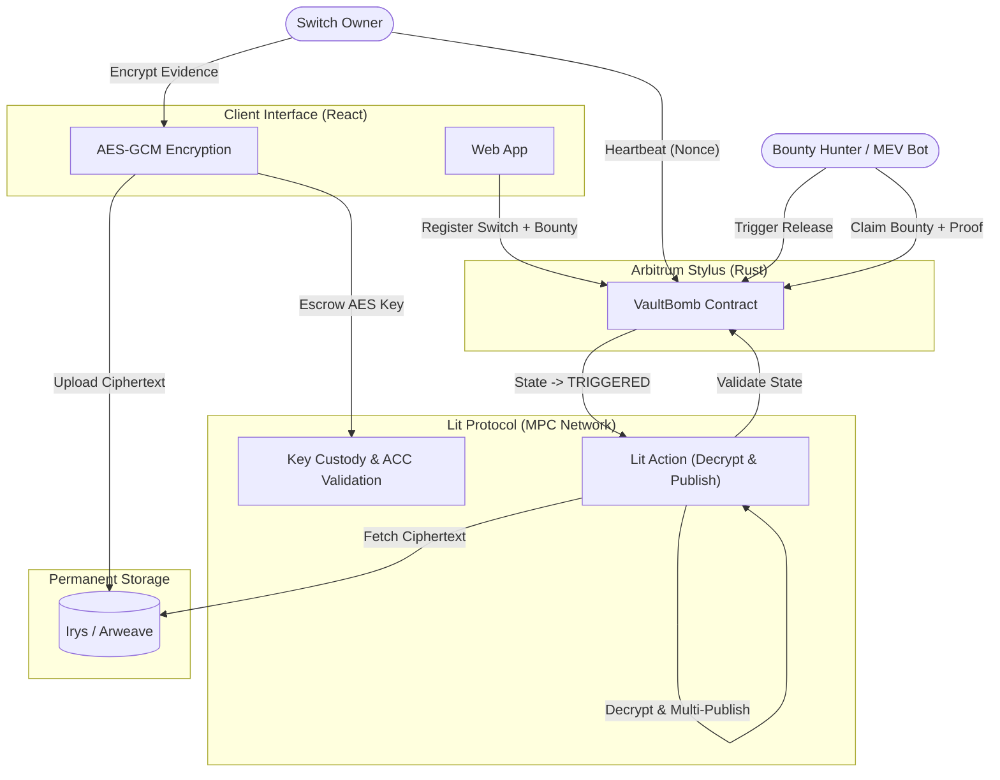
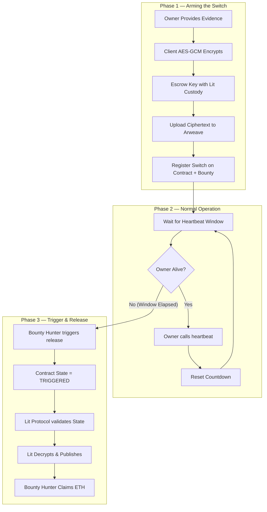

# Vault_bomb — Project Document

## 1. Problem Statement

Traditional dead-man's switches depend on a person, server, or service that controls the release process. If that component is compromised, disabled, or legally compelled to stop operating, the release mechanism fails.

Concretely:
- **Timed emails / centralized servers** — can be seized or shut down by a legal order targeting the operator.
- **Cloud-hosted services** — can be subpoenaed; the provider can be compelled to suspend the service or hand over data.
- **Centralized databases** — represent a single point of failure; a single legal order can halt the release.

In each case, the critical weakness is the same: a single identifiable party controls the release. Targeting that party is sufficient to suppress it.

---

## 2. Proposed Solution & Design Goals

Vault_bomb is designed to remove the single point of failure from the release mechanism.

By combining permanent decentralized storage, decentralized/threshold key custody, and an immutable on-chain smart contract, Vault_bomb guarantees that once evidence is locked in, no human, corporation, or government can stop the release if the journalist is silenced

**Core design principle:** To suppress a release, an adversary must simultaneously defeat three independently operating layers — on-chain logic, decentralized key custody, and permanent decentralized storage — rather than a single hardened system.

### How it works, end to end

1. **Arm:** The owner locally encrypts evidence (AES-256-GCM), uploads the ciphertext to Arweave via Irys, escrows the decryption key with a custody layer under an on-chain access condition, and registers a switch on an Arbitrum Stylus contract with a configurable heartbeat window and an ETH bounty.
2. **Stay alive:** The owner periodically calls `heartbeat()` to reset the countdown. Each call requires a strictly increasing nonce.
3. **Trigger:** If the heartbeat window plus grace period elapses without a valid `heartbeat()`, any address can call `triggerRelease()` and claim the ETH bounty. This replaces a centralized cron job with a permissionless, financially incentivized trigger.
4. **Release:** The custody layer independently verifies the on-chain triggered state, decrypts the ciphertext, verifies the evidence hash, and publishes the plaintext.

---

## 3. Technology Stack

| Layer | Technology | Notes |
|---|---|---|
| Smart contract | Arbitrum Stylus — Rust → WASM | Deployed on Arbitrum Sepolia at `0x0c92d14eea513a216ab1559deac8e0ce8fabc3b9` |
| Storage | Irys / Arweave | Pay-once permanent storage; encrypted ciphertext cannot be deleted after upload |
| Key custody — MVP | `lit-simulator` (Node.js/Express) | Functional mock of Lit Protocol; mirrors the same API surface without requiring Lit testnet deployment |
| Key custody — Production | Lit Protocol (PKP + Lit Actions) | Threshold-distributed MPC with on-chain Access Control Conditions (ACC) |
| Trigger mechanism | Permissionless `triggerRelease()` + ETH bounty | Any address can call; first valid caller receives the bounty |
| Frontend | React + Vite + TypeScript + TailwindCSS | Arm flow, watcher dashboard, per-switch detail view, heartbeat interface |
| Backend (custody sim) | Node.js / Express (`lit-simulator/index.js`) | Exposes `/store-key`, `/get-key/:switchId`, `/simulate-trigger`, `/get-proof/:switchId`, `/health` |
| Network | Arbitrum Sepolia (testnet) | L1 Ethereum block numbers used for heartbeat timing |

---

## 4. Architecture

### 4.1 Four-Layer Trust Model
The protocol operates across four independent layers. Each layer has a distinct failure domain.

| Layer | Current MVP | Production |
|---|---|---|
| **Logic** | Arbitrum Stylus contract (`contracts/src/lib.rs`) | Same — no upgrade path, no admin key |
| **Trigger** | Permissionless `triggerRelease()` + ETH bounty | Same |
| **Key custody** | `lit-simulator` — Node.js/Express | Lit Protocol (PKP + Lit Actions) |
| **Storage** | Irys → Arweave | Same |

### 4.2 Component Responsibilities

- **Client / Frontend:** Browser-based interface for the switch owner and for watchers/bounty hunters. Encrypts evidence locally, uploads to Irys, posts to custody, and registers on-chain.
- **Evidence Storage (Irys / Arweave):** Permanent, immutable storage for the encrypted ciphertext.
- **Key Custody (MVP / Production):** Stores AES key and performs decryption on trigger. Lit Protocol uses threshold nodes and Lit Actions. MVP uses a Node.js simulator.
- **Arbitrum Stylus Contract:** On-chain enforcement of switch state. Contract cannot be paused, upgraded, or modified. Registers switches, validates heartbeats, enforces trigger condition, pays out bounty.
- **Trigger Mechanism:** Permissionless trigger (`triggerRelease()`) with an ETH bounty.

### 4.3 Current Implementation Diagram

### 4.4 Data & Control Flow (Three-Phase Commit)
On-chain registration must occur only after the custody layer has confirmed it holds the key. If the switch fires but the custody layer has no record of the key, decryption fails.

The enforced order is:
1. AES Encrypt locally in browser
2. POST `/store-key` to Lit Simulator (returns signature)
3. Upload payload to Irys/Arweave (returns `irysTxId`)
4. Call `register_switch()` + ETH bounty on Stylus Contract

---

## 5. Lifecycle Flowchart

---

## 6. Threat Model & Security Invariants

### 6.1 Threat Model
| Threat | Mechanism | Status |
|---|---|---|
| **Single provider subpoena** | Evidence is encrypted client-side. Key is held by custody layer under ACC. | ✅ Final design (simulated in MVP) |
| **Trigger suppression** | `trigger_release()` is permissionless and bounty-incentivized. | ✅ Implemented |
| **Accidental trigger** | Grace period (20 L1 blocks) provides buffer. | ✅ Implemented |
| **L2 sequencer timestamp manipulation** | Heartbeat timing uses L1 Ethereum block numbers. | ✅ Implemented |
| **Heartbeat replay attack** | `heartbeat()` requires strictly increasing nonce. | ✅ Implemented |
| **Evidence tampering** | `SHA-256(plaintext)` committed on-chain, verified on decryption. | ✅ Implemented |
| **Coercion / duress** | `heartbeat()` from `duress_wallet` immediately triggers release. | ✅ Implemented |

### 6.2 Security Invariants
- `trigger_release()` has no access control beyond the on-chain time check.
- No function can pause, upgrade, or redirect a registered switch (no admin key).
- `heartbeat()` requires authorized wallet and strictly increasing nonce.
- Registration causally follows custody key acknowledgment (three-phase commit).
- Triggering on-chain must succeed before custody layer decrypts.

---

## 7. Risk Register

| Risk | Severity | Mitigation |
|---|---|---|
| `lit-simulator /get-key` returns AES key to anyone | **Critical** | Acceptable for MVP. Production uses Lit ACC. |
| Owner loses `switchId` on browser clear | **High** | Persisted to `localStorage`. External backup needed. |
| No heartbeat reminder (accidental trigger) | **High** | Countdown timer planned in `SwitchDetail.tsx`. |
| `confirm_publication()` called without verified Lit proof | **Medium** | Acceptable for MVP. Production uses real Lit Action ECDSA. |
| Deterministic 65-byte mock proof | **Medium** | Acceptable for MVP. Production uses Lit Action `signEcdsa`. |
| Lit Simulator keys stored on Render free tier (ephemeral) | **Medium** | Reloads on startup via `fs.readFileSync`. Acceptable for testnet. |

---

## 8. Future Roadmap

- **Phase 2 — Lit Protocol Integration:** Replace simulator with actual decentralized threshold custody.
- **Phase 3 — Multi-Channel Publishing:** Decrypted evidence published across Arweave, X, Telegram, Signal, Farcaster, Lens.
- **Phase 4 — Hardening:** L1 force-inclusion path to bypass Arbitrum sequencer censorship. External audits. IPFS-hosted dashboard.
- **Phase 5 — Field Pilot:** Partner with a press-freedom organization for canonical address distribution. Onboard real switches.
- **Phase 6 — Scale:** Managed deployment tier for newsrooms. Localized UI. Public-goods funding.