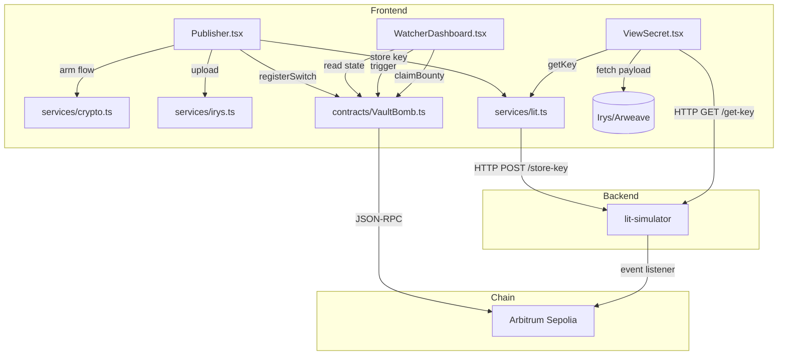

# Vault_bomb — Architecture Analysis & Improvement Recommendations

> **Scope:** Read-only architectural review. No code will be changed until explicitly approved.

---

## 1. Architecture Summary

Vault_bomb is a **four-layer dead-man's switch** built for journalists and whistleblowers. The layers are deliberately independent so that defeating any single one cannot suppress a release:

| Layer | Current Implementation | Design Intent |
|---|---|---|
| **Logic** | Arbitrum Stylus contract (Rust/WASM) | Immutable heartbeat state machine |
| **Custody** | `lit-simulator` Express server (mock) | Real Lit Protocol MPC (Phase 2 target) |
| **Storage** | Irys devnet → Arweave | Permanent, permissionless ciphertext store |
| **Frontend** | React + Vite (two tabs) | Owner arming + public watcher dashboard |

The flow is: **Encrypt locally → Upload to Irys → Store AES key in Lit → Register on-chain → Heartbeat periodically → Anyone triggers on expiry → Lit releases key → Evidence published.**

---

## 2. Current System Analysis

### What Is Working Well
- **Smart contract** is well-designed: immutable, no proxy, no admin key, heartbeat nonce is strictly increasing, `triggerRelease()` is permissionless, bounty escrow is sound.
- **`GlobalRateLimitContext`** is a clean, reusable sliding-window rate limiter that prevents RPC 429 bursts.
- **`withRetry` / `batchedMap`** in `WatcherDashboard.tsx` show careful thought about public RPC limits.
- **`simplifyError`** in `Publisher.tsx` provides excellent user-facing error messages.
- **`ensureCorrectNetwork`** in `VaultBomb.ts` auto-prompts the user to switch/add Arbitrum Sepolia.
- **Pre-flight `staticCall`** before `triggerRelease` prevents wasted gas on already-expired checks.
- **Stylus contract** implements `checkUpkeep/performUpkeep` for Chainlink compatibility (partially).

### Critical Gaps & Issues

The following issues are grouped by severity.

---

## 3. Critical Issues (P0 — Security / Correctness)

### C1 — `/get-key` is completely unauthenticated
**File:** `lit-simulator/index.js:86`

The `/get-key/:switchId` endpoint returns the raw AES key to **any caller** who knows the `switchId`. There is zero on-chain verification. The switch ID is publicly visible on-chain via `SwitchRegistered` events.

```js
// Anyone who has seen the on-chain event can call this:
app.get("/get-key/:switchId", (req, res) => {
    res.json({ aesKey: data.aesKey });  // No auth, no on-chain check
});
```

**Risk:** The entire premise of the system is broken in its current form. A state actor who knows a `switchId` can retrieve the AES key and decrypt the evidence **before** the switch is triggered.

**Fix path:** The simulator must verify `is_triggered == true` on-chain before returning the key — the same ACC the real Lit Protocol would enforce.

---

### C2 — `switchId` is generated from `Math.random()` (weak entropy)
**File:** `frontend/src/components/Publisher.tsx:148`

```ts
const switchId = ethers.id(Math.random().toString());
```

`Math.random()` is not cryptographically secure. On some JS engines, the PRNG output is predictable. A collision or brute-force attack on the ID space would allow a switch to be overwritten or impersonated.

**Fix path:** Replace with `ethers.hexlify(window.crypto.getRandomValues(new Uint8Array(32)))`.

---

### C3 — `confirm_publication` gated only by `triggerer` wallet, not Lit proof
**File:** `contracts/src/lib.rs:173`

The `confirm_publication` function (which emits `PlaintextPublished`) can be called by the `triggerer_wallet` without any actual proof that decryption/publication happened. Anyone who calls `triggerRelease()` can immediately call `confirm_publication()` to fake a publication event.

**Fix path:** This function should require a Lit Action signature — same as `claim_bounty`. Until real Lit integration, document this gap clearly in the UI.

---

### C4 — Bounty can be claimed before actual publication
**File:** `contracts/src/lib.rs:188`

`claim_bounty` only verifies `is_triggered` and that the caller is the `triggerer_wallet`. Publication is not verified. The `lit_proof` check is a length-only mock (`lit_proof.len() != 65`). A triggerer can claim the bounty without Lit ever decrypting/publishing anything.

**Fix path:** The real Lit integration must produce a verifiable on-chain signature. Until then, document clearly that this is a mock.

---

## 4. High Priority Issues (P1 — Functionality & UX)

### H1 — Publisher is one-shot; no switch management after arming
**File:** `frontend/src/components/Publisher.tsx`

Once a switch is registered, `isRegistered` flips to `true` and the form is replaced with a success message. The user loses the `switchId`. If they refresh the page, they have no way to find their own switch ID to send heartbeats.

**Fix path:**
- Persist the `switchId` (and `irysTxId`) to `localStorage` after successful registration.
- Show a "My Switches" panel in the Publisher tab that lists the user's own registered switches.
- The `switchId` should be shown and copyable post-registration.

---

### H2 — No dedicated "My Switches" / owner view
Users must scroll the entire public Watcher Dashboard to find their own switch. If there are many switches, they may miss their own or miss the heartbeat deadline.

**Fix path:** The Watcher Dashboard should have a "My Switches" section filtered by `wallet.toLowerCase() === sw.owner.toLowerCase()` with prominent heartbeat countdown display.

---

### H3 — Heartbeat deadline is not surfaced anywhere
**File:** `frontend/src/components/WatcherDashboard.tsx:369`

The dashboard shows the status (`ARMED`, `GRACE_PERIOD`, etc.) but never shows **when the next heartbeat is due** or how many blocks remain. A journalist does not know if they need to send a heartbeat today or in a week.

**Fix path:** For each switch, compute and display:
- Blocks remaining until window expires: `lastHeartbeat + windowBlocks - currentBlock`
- Human-readable estimate: `remainingBlocks × 12s ÷ 3600 = X hours`

---

### H4 — Bounty claim flow requires copy-pasting from server terminal
**Files:** `frontend/src/components/ClaimBountyButton.tsx:35`, `lit-simulator/index.js:165`

The `window.prompt()` copy-paste UX is developer-only and completely unusable by non-technical bounty hunters. In production, this must be an API call.

**Simulator fix path (short-term):** Expose a `/get-proof/:switchId` endpoint on the lit-simulator that returns the bounty proof, so the frontend can fetch it automatically instead of prompting.

---

### H5 — No file/binary evidence support
**File:** `frontend/src/components/Publisher.tsx:225`

The publisher only accepts a `<textarea>` for text input. Journalists typically have PDFs, videos, or document archives. The crypto service only handles string encryption.

**Fix path:**
- Add a `<input type="file">` option to the Publisher.
- Extend `crypto.ts` with `encryptBlob(file: File, key: CryptoKey)` that reads as `ArrayBuffer`.
- Extend `irys.ts` with `uploadBinaryToIrys(data: Uint8Array, mimeType: string)`.

---

### H6 — Wallet disconnect / account change not handled
**File:** `frontend/src/App.tsx:11`

The app only reads the wallet on mount. If the user switches accounts in MetaMask or locks the wallet, the app UI still shows the old address but all transactions will fail silently or send from the wrong account.

**Fix path:** Subscribe to `window.ethereum.on('accountsChanged', ...)` and `'disconnect'` events to update `wallet` state reactively.

---

### H7 — `WatcherDashboard` renders deeply nested inline JSX
**File:** `frontend/src/components/WatcherDashboard.tsx:339`

The switch card rendering is 40+ lines of deeply nested inline JSX with hardcoded colour strings and inline `style` objects. This violates the project's own frontend rules ("Avoid deeply nested JSX", "Never duplicate UI") and makes the status colour logic appear in **two places** (lines 341–344 and 351–355).

**Fix path:** Extract a `SwitchCard` component that takes a `SwitchInfo` and renders the card. Define a `STATUS_COLORS` map to eliminate the duplication.

---

## 5. Medium Priority Issues (P2 — Maintainability & Architecture)

### M1 — `CONTRACT_ADDRESS` is duplicated in three files
**Files:** `Publisher.tsx:9`, `WatcherDashboard.tsx:10`, `ViewSecret.tsx:6`

All three read `import.meta.env.VITE_CONTRACT_ADDRESS` independently. There is no single source of truth.

**Fix path:** Re-export `CONTRACT_ADDRESS` from `contracts/VaultBomb.ts` (it already reads it on line 14) and import it from there in other files.

---

### M2 — `lit.ts` returns hardcoded mock values
**File:** `frontend/src/services/lit.ts:61`

```ts
return {
    ciphertext: "simulated_ciphertext",
    dataToEncryptHash: "simulated_hash"
};
```

These values are stored in the Irys payload (`litCiphertext`, `litHash`) and later passed to `decryptKey`. The entire round-trip is mocked, meaning the values stored on Arweave are not real ciphertext.

**Fix path (short-term):** Return the `switchId` as the `litCiphertext` so the simulator can use it as a lookup key without confusion. Document clearly.

**Fix path (long-term):** Replace with the real `@lit-protocol/lit-node-client` SDK calls.

---

### M3 — `async function rpcCall` defined inside component body
**File:** `frontend/src/components/WatcherDashboard.tsx:124`

`rpcCall` is recreated on every render because it captures `acquireRef` and `reportRef` via closure but is not wrapped in `useCallback`. The `withRetry` and `batchedMap` utilities are also defined at module level in the same file.

**Fix path:** Move `withRetry` and `batchedMap` to a `src/utils/rpc.ts` module. Extract `rpcCall` as a custom hook `useRpcCall()`.

---

### M4 — Polling and event listeners both run concurrently without deduplication
**File:** `frontend/src/components/WatcherDashboard.tsx:279`

The `useEffect` sets up both a 30-second poll (`fetchSwitches`) **and** an event listener for `Triggered`. On a `Triggered` event, the parent state is updated immediately. But 30 seconds later, `fetchSwitches` will still run and overwrite that state with potentially stale on-chain data. These two update paths are not coordinated.

**Fix path:** When an event listener fires, cancel the next scheduled poll tick or ensure `fetchSwitches` merges state rather than replacing it.

---

### M5 — `lit-simulator` stores AES keys in a plain JSON file with no encryption at rest
**File:** `lit-simulator/index.js:27`

The `keys.json` file contains raw base64-encoded AES-256 keys. Anyone with filesystem access to the Render/Node server gets all keys.

**Fix path (simulator):** Encrypt the key store at rest using an `APP_SECRET` env variable (e.g., AES-256-GCM of the JSON blob). This is still a simulator but it models the trust assumptions better and avoids accidental key leakage in logs.

---

### M6 — No TypeScript strictness on `any` types in contract interaction
**File:** `frontend/src/components/WatcherDashboard.tsx:148`

`getSwitchInfo` returns a tuple accessed by positional index (`info[0]`, `info[2]`, etc.), and `getContract()` returns `ethers.Contract` (untyped). This is fragile — any reordering of return values in the ABI will silently break the UI.

**Fix path:** Generate a typed contract interface using `typechain` or define a manual `SwitchInfoResult` type that maps the tuple positions with named getters.

---

### M7 — `client/setup.js` is orphaned from the frontend
**File:** `client/setup.js`

This file appears to be an early CLI-based setup script that is no longer mentioned in the main README workflow. It uses a different dependency set from the frontend (`@irys/sdk` vs `@irys/web-upload`).

**Fix path:** Either integrate its functionality into the frontend Publisher, or document it clearly as a standalone CLI alternative and wire it into the dev workflow.

---

## 6. Low Priority Issues (P3 — Polish & UX)

### L1 — App.tsx has heavy inline styles (violates separation concerns)
**File:** `frontend/src/App.tsx:47`

The `<header>` and nav elements use long inline `style` objects. These should be CSS classes.

### L2 — `<textarea>` for secret has no character limit warning
Large secrets increase Irys upload cost. A character counter or size warning would help users.

### L3 — No loading skeleton for WatcherDashboard
When loading, the dashboard shows a plain "Loading..." text. A skeleton card would match premium design standards.

### L4 — Irys devnet hardcoded in `ViewSecret.tsx`
**File:** `frontend/src/components/ViewSecret.tsx:30`
`https://devnet.irys.xyz` is hardcoded. Should be an env variable so mainnet can be configured without code changes.

### L5 — No favicon or page title
`index.html` uses `vite.svg` as the favicon and "Vite + React + TS" as the title. Should be branded as Vault Bomb.

### L6 — No `aria-label` on action buttons in WatcherDashboard
Action buttons (Trigger, Heartbeat, Claim) lack descriptive `aria-label` attributes identifying which switch they act on.

---

## 7. Data Flow Impact Assessment



**Key observation:** `lit-simulator` acts as a single-point-of-trust for the AES key. It currently has **no access control**, making the system insecure as-is for any real-world use.

---

## 8. Recommended Implementation Strategy

The improvements are grouped into three tracks that can proceed in parallel:

### Track A — Security (must land before any real-world use)
1. Add on-chain `is_triggered` verification to `/get-key` in the simulator.
2. Replace `Math.random()` with `crypto.getRandomValues` for `switchId`.
3. Expose `/get-proof/:switchId` on the simulator to eliminate `window.prompt`.

### Track B — Functionality (high user impact)
1. Persist `switchId` + `irysTxId` to `localStorage` post-registration.
2. Show heartbeat countdown (blocks remaining + human-readable time) per switch.
3. Add a "My Switches" filtered view in the Watcher tab.
4. Subscribe to MetaMask `accountsChanged` / `disconnect` events.
5. Add file/binary evidence upload support.

### Track C — Code Quality (maintainability)
1. Extract `SwitchCard` component from `WatcherDashboard`.
2. Move `withRetry`/`batchedMap` to `src/utils/rpc.ts`.
3. Re-export `CONTRACT_ADDRESS` from `VaultBomb.ts` (single source of truth).
4. Add `typechain` or a typed `SwitchInfoResult` interface.
5. Move inline styles in `App.tsx` to CSS classes.

---

## 9. Alternatives Considered

| Improvement | Alt A | Alt B | Recommended |
|---|---|---|---|
| Switch ID generation | `Math.random()` (current — broken) | `uuid` library | `crypto.getRandomValues` — no dep, cryptographically secure |
| Heartbeat countdown | Server-side push | Frontend poll current block | Frontend compute from `currentBlock` already available in state |
| Local key persistence | Cookie | `sessionStorage` | `localStorage` — survives refresh, scoped to origin |
| Contract typing | Manual types | `typechain` codegen | `typechain` for long-term safety; manual types acceptable for short-term |
| Simulator auth | JWT | On-chain RPC call | On-chain RPC `getSwitchInfo` — models real Lit ACC exactly |

---

## 10. Risks

| Risk | Severity | Mitigation |
|---|---|---|
| Simulator `/get-key` exposes keys to anyone | **Critical** | Fix immediately (Track A #1) |
| `Math.random()` switchId collision/prediction | **High** | Fix immediately (Track A #2) |
| No heartbeat reminder = journalist misses deadline | **High** | Track B #2 |
| User loses switchId on page refresh | **High** | Track B #1 |
| `confirm_publication` is faked without proof | **Medium** | Document clearly; fix with real Lit SDK |
| `litCiphertext: "simulated_ciphertext"` stored on Arweave | **Low** | Permanent but harmless data; clean up in Lit SDK migration |

---

## 11. Files Expected to Change (by track)

### Track A (Security)
| File | Change |
|---|---|
| `lit-simulator/index.js` | Add on-chain check in `/get-key`; add `/get-proof` endpoint |
| `frontend/src/components/Publisher.tsx` | Replace `Math.random()` with `crypto.getRandomValues` |
| `frontend/src/components/ClaimBountyButton.tsx` | Replace `window.prompt` with `/get-proof` fetch |

### Track B (Functionality)
| File | Change |
|---|---|
| `frontend/src/components/Publisher.tsx` | Add file upload; persist switchId to localStorage; show switchId post-registration |
| `frontend/src/components/WatcherDashboard.tsx` | Add heartbeat countdown; add "My Switches" section |
| `frontend/src/App.tsx` | Subscribe to `accountsChanged` / `disconnect` events |
| `frontend/src/services/irys.ts` | Add binary upload support |
| `frontend/src/services/crypto.ts` | Add `encryptBlob` / `decryptBlob` functions |

### Track C (Quality)
| File | Change |
|---|---|
| `frontend/src/components/WatcherDashboard.tsx` | Extract `SwitchCard` component |
| `frontend/src/utils/rpc.ts` | **[NEW]** Move `withRetry` + `batchedMap` here |
| `frontend/src/contracts/VaultBomb.ts` | Export `CONTRACT_ADDRESS`; add typed result interface |
| `frontend/src/App.css` | Move inline header/nav styles to CSS classes |
| `frontend/index.html` | Update title and favicon |

---

## 12. Testing Strategy

Since there are currently no tests, each track should establish baseline coverage:

- **Track A:** Integration test for `/get-key` with a mocked `ethers.Contract` that returns `is_triggered = false` — verify 403 is returned.
- **Track B:** Unit tests for `encryptBlob`/`decryptBlob` in `crypto.ts`. Jest + `@testing-library/react` for Publisher's localStorage persistence.
- **Track C:** Snapshot tests for `SwitchCard` with different `SwitchStatus` values. Unit tests for `withRetry` covering retry exhaustion and immediate revert pass-through.

---

## 13. Rollback Strategy

All changes are additive or localized:
- **Smart contract** is not modified — all changes are frontend/simulator only.
- **Simulator** changes add endpoints without breaking existing ones.
- **Frontend** changes to state persistence are guarded with `try/catch` around `localStorage` calls.
- **Component extraction** (SwitchCard) is pure refactor — preserves identical rendered output.

Git branch per track; merge to `main` only after smoke-test on testnet.

---

## 14. Open Questions

> [!IMPORTANT]
> Please review these before approving any implementation:

1. **Real Lit Protocol timeline:** Is the plan to integrate the real Lit Protocol SDK before any real-world use, or should the simulator be hardened further as a longer-term solution?
2. **File evidence scope:** Should the Publisher support a single file upload, or multiple files (e.g., a zip/archive)?  
3. **localStorage vs. wallet-signed storage:** Should the `switchId` be stored in plain `localStorage` (lost on browser clear), or signed/encrypted with the wallet so it can be recovered from another device?
4. **Chainlink/Gelato registration:** Is automated keeper registration in scope for the next sprint, or is the public `triggerRelease()` permissionless bounty the primary mechanism for now?
5. **`confirm_publication` removal:** Should this function be removed from the contract (since it can be called by anyone who triggers) or retained and gated behind a real Lit proof in the next contract version?
